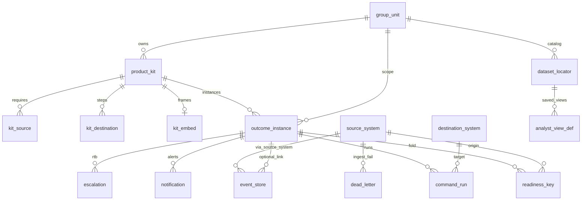
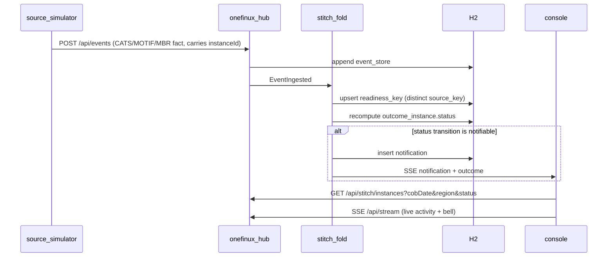

# BRD — One Finance UX application build

Owner: Praveen Kumar · Status: for the build team · Companion to `docs/brd/architecture-group.md`.

This is the document a developer picks up to make the console a real product. It covers the entities, who calls whom, when we decide an event, the API surface, how to onboard a product, which skill owns which part, and exactly what is in the demo build versus later.

## 1. Modules and ports

| Module | Port | Responsibility |
|---|---|---|
| `onefinux-hub` | 7070 | Event ingest, translation, the stitch fold, REST + SSE, serves the console at `/console/` |
| `source-simulator` | 7081 | Stubs the systems of record (CATS/MOTIF/MBR) and the destinations (Helix/FAS). Drives the demo. |
| `docs/design/mockups` | served at `/console/` | The console UI. `console.js` hydrates it from the hub API. |

The browser talks only to the hub. The hub talks to the simulator for downstream commands. Nothing in the browser touches a bus.

## 2. Entities (already designed — do not invent a second model)

DDL: `docs/schema/onefinux-stitch.sql`. The stitch is `outcome_instance`; everything hangs off it.



Locked column rule: `event_store.source_system` **is** the foreign key to `source_system.source_id`. Do not add a second `source_id` on events. `notification.outcome_key` carries the `kit_id`.

Status vocabulary: instance `NOT_YET | READY | BLOCKED | CLEARED | DELAYED`; readiness key `WAITING | COMPLETED | FAILED | REVOKED`.

## 3. How an event becomes a screen



### When we decide an event (the fold rule)

Recompute an instance after every readiness change:

- any key `FAILED` → **BLOCKED**, `named_blocker = "<SOURCE> <key> FAILED"`.
- else any key `WAITING` → **NOT_YET** (or **DELAYED** if past SLA).
- else all keys `COMPLETED` and every required source present → **READY**.
- user signs off a READY instance → **CLEARED**.
- `REVOKED` on any completed key drops the instance out of READY.

### Which service is called

- Ingest and fold: the hub, in process. No product logic.
- Downstream command (post to MOTIF via FAS, run Helix): the hub calls the simulator's `/helix/analysis` or `/fas/post`; the completion event must **echo the `runId`** or it is ignored (`command_run.echo_ok`).
- Notify: the hub's notification channels (in-app SSE now; email/Teams/ServiceNow/Barclays Now later).

### When we notify (and when we do not)

Notify on: `READY, BLOCKED, DELAYED, SLA_BREACHED, REVOKED, CLEARED, SIGNED_OFF, POSTED, ESCALATED`.
Never notify on: raw facts, PROGRESS ticks, or LLM/advisory output.

## 4. API surface (how the APIs work together)

Full contract: `contracts/openapi.yaml`. Summary of the stitch API (all under `/api/stitch`, plus the existing `/api/events` and `/api/stream`):

| Area | Method + path | Purpose |
|---|---|---|
| Context | `GET /context` | business date, zone, group units, COB dates, regions, live client count |
| Tenancy | `GET /group-units` | onboarded tenants |
| Board / fold | `GET /instances?groupUnit&cobDate&region&status` | head board + user list; carries fold counts |
| Detail | `GET /instances/{id}` | keys, embed, echo, destinations |
| Facts | `GET /instances/{id}/events` | events for one instance (audit) |
| Action | `POST /instances/{id}/signoff` | sign off a READY instance → CLEARED |
| Action | `POST /instances/{id}/post` | post to MOTIF via FAS → command_run, echo pending |
| Action | `POST /instances/{id}/escalate` | raise an escalation to RTB |
| Inbox | `GET /notifications?limit` | notification inbox (instance-linked) |
| RTB | `GET /rtb` | escalations, dead letters, feed watermarks |
| RTB | `POST /deadletters/{id}/replay` | dual-control replay |
| Onboard | `GET /sources`, `GET /destinations`, `GET /kits` | catalog |
| Onboard | `POST /kits` | register a product kit as data (no code) |
| Analyst | `GET /datasets?groupUnit` | bound origins for a unit |
| Analyst | `GET /explore?source&cobDate&region&status` | explore facts from bound origins |
| Analyst | `GET /views?groupUnit`, `POST /views`, `DELETE /views/{id}` | saveable grid/pivot/chart definitions |
| Admin | `POST /reset` | reset the two demo instances so the simulator can re-drive them |
| Live | `GET /api/stream` | SSE: `event`, `outcome`, `notification`, `reset`, `hello` |

The console never invents an id. Every dropdown (COB, region, group unit, source) is filled from one of these endpoints, and every filter is a query parameter on `GET /instances` or `GET /explore`.

## 5. Onboard a product (ready-to-use)

Config screen posts one body to `POST /api/stitch/kits`:

```json
{
  "kitId": "REG-15C3",
  "groupUnitId": "REV-ACC",
  "domain": "Regulatory",
  "question": "Can I produce the 15C3 report?",
  "renderer": "ENGINE_REPORT",
  "userActions": "SIGN_OFF",
  "ceesProduct": "product:REG-15C3",
  "slaCutoff": "07:30",
  "sources": [{"sourceId": "CATS", "required": true}],
  "destinations": [{"destId": "PNL_AGENT", "stepOrder": 1}],
  "embed": {"url": "https://axiom.example/15c3", "allowedOrigin": "https://axiom.example", "chrome": "HOST"}
}
```

The hub writes `product_kit` + `kit_source` + `kit_destination` + `kit_embed` and the kit shows up on the board with **no new Java type**. The full step-by-step is in `docs/onboarding.md`.

## 6. Analyst explorer

New page `docs/design/mockups/analyst.html`, backed by `GET /explore` and `analyst_view_def`.

- Only origins already bound to the group unit via `dataset_locator` (CATS, MOTIF, MBR). The explorer cannot register a new source — that stays config.
- Filters: source, COB date, region, key status.
- Grid now; pivot and chart are the same saved-view shape (`widget = GRID | PIVOT | CHART`).
- Save / load a view: name, columns, filters. Stored in `analyst_view_def` with a `cees_report` scope.
- Grid uses licensed Wijmo when its files are on the machine; otherwise a contract-shaped grid renders the same `field_map_json`, so swapping in Wijmo is a drop-in with no data change.

## 7. Which skill owns which part

| Part | Skill |
|---|---|
| Console chrome / theme / iframe host | `barclays-ib-console`, `embed-partner-screen` |
| Head board | `bu-head-view` |
| Sign-off / post / ready pack | `colleague-view` |
| Delays / escalations / dead letters | `rtb-support-view` |
| Onboarding + adapters + fold wiring | `engineering-view` |
| Bind a source or destination (incl. the simulator path) | `bind-source-destination` |
| Register a kit as data | `register-outcome-kit` |
| Analyst grid / pivot / chart | `wijmo-outcome-grid` |

A team that wants to work on one component reads its skill and the matching `/api/stitch` endpoints above.

## 8. Demo build vs later

**In (a workable product slice):** REV-ACC + FOBO, two instances driven by the simulator; working COB / region / filters / bell / SSE; sign-off / post / escalate that change the fold; analyst explorer with saved views; onboard a second kit as data; OpenAPI + this BRD + onboarding note.

**Later (designed, not wired):** bank Kafka/Solace and real FEED watermarks; real CEES; live Helix/FAS; Barclays Now; React `experience/web/`.

## 9. Run and verify

```bash
./scripts/run.sh                              # build + start hub (7070) and simulator (7081)
open http://localhost:7070/console/index.html # the console
curl -s -XPOST http://localhost:7070/api/stitch/reset
curl -s -XPOST http://localhost:7081/sim/scenarios/fobo   # drive R-1042 READY and R-2031 BLOCKED live
```

Watch the home board flip R-1042 to READY and R-2031 to BLOCKED, a notification appear in the bell, and the activity feed update over SSE.
