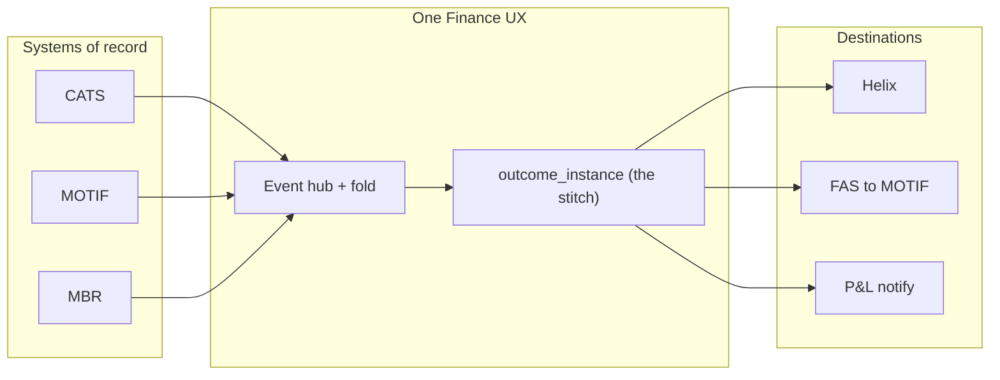

# BRD — One Finance UX (for the architecture group)

Owner: Praveen Kumar · Status: for review · Companion to `docs/One_Finance_UX_BRD.docx` (kept as the long-form archive).

This is the short version. Three pages. It says what we are solving, what we unify, what the CEO-level sees, what the developers build, and how we keep everyone agreeing on the same design.

## 1. The business problem

At close of business, a group unit (start with Revenue Accounting) has to answer one question per outcome: **"Can I execute this rec / produce this report / post this book?"**

Today that answer is scattered:

- Each origin has its own screen and its own status word (CATS "posted", MOTIF "MB014 rejected", MBR "break open").
- Each destination has its own screen (Helix, FAS→MOTIF, P&L).
- There is no single row that says "this outcome, this date, this region, this run is READY or BLOCKED and why."

So a head cannot see Ready/Blocked without asking. A user cannot sign off a **named** instance. Run-the-bank chases tickets instead of reading a fold. Every team re-implements the same reconciliation of statuses in a slightly different way.

## 2. What we unify

One platform, one shape, applied to every outcome:

- **Group unit** — the onboarding tenant (Revenue Accounting, Product Control, ...).
- **Product kit** — the outcome recipe as data: its question, its sources, its destinations, its renderer, its user actions. FOBO is the first kit. There is no FOBO code path.
- **Outcome instance** — the stitch. One row for one COB, one region, one slice, one run. This is the product.

Origins stay origins. Destinations stay destinations. We do **not** rebuild Helix or MOTIF. We stitch their facts into one instance and fold readiness over it.



## 3. What the CEO-level team looks at

One shell. Traffic lights. For each entitled group unit:

- Outcome name, renderer, status word (NOT_YET / READY / BLOCKED / CLEARED / DELAYED).
- SLA / delay flag and escalation count.

No book grid. No "how many Kafka messages." No engine internals. A head who is also a user can drill into the outcome; a head-only role sees only the board.

## 4. What the development teams look at

- **Facts on the bus.** Every state change is an event. In production the bus is Kafka (or the bank's Solace/MQ). In the POC and the demo it is HTTP into the hub, driven by a **stub simulator** that plays the systems of record.
- **Fold in the hub.** Readiness counts **distinct** `(instance, source, source_key)`. `FAILED` blocks. `REVOKED` withdraws. Downstream completions must echo the `runId`.
- **Browser never touches the bus.** Reads are REST snapshots; live updates are Server-Sent Events; writes are audited REST commands that become workflow events.
- **Products are data, never code.** A kit is a set of rows / YAML. Onboarding a second kit adds no Java type. There is no `if (product == FOBO)`.
- **Heavy screens are partner iframes.** Helix's own screen is embedded with the shared theme, not cloned in this repo.
- **LLM is advisory only.** Agent commentary never sits on the readiness fold.

## 5. How we agree the design

Two artefacts are the single source of truth, and every team measures against them:

- **Visual truth** — `docs/design/mockups/` (the console) and `experience/theme/onefinux-tokens.css` (the theme other teams copy).
- **Data truth** — `docs/schema/onefinux-stitch.sql` (the entities and relationships) plus `contracts/openapi.yaml` (how the APIs are called).

And one worked example that must be identical in every screen, query and event:

```
REV-ACC → FOBO → R-1042 READY (RUN-A37C) / R-2031 BLOCKED (MOTIF MB014, ESC-19, DL-4402)
sources: CATS, MOTIF, MBR
```

If a mock, a table, or an event does not use these exact keys, it is wrong.

## 6. Scope line — demo vs production

**In the demo build (a real, working slice):**

- REV-ACC + FOBO kit + two instances, driven live by the stub simulator.
- Working COB date, region, filters, notification inbox, live activity over SSE.
- Sign-off / post / escalate that persist and change the fold.
- Analyst explorer over the already-bound origins, with saveable views.
- Onboard a second kit as data — no new code.

**Deferred, but designed here:**

- Real Kafka / Solace and FEED watermarks against production topics.
- Real CEES entitlements (the demo ships a fail-open local stub; the contract is fail-closed).
- Live Helix / FAS (the demo keeps the mocks on port 7081).
- Barclays Now channel and the full React `experience/web/` rewrite.

## 7. Non-functionals we commit to

- Deterministic fold — state is a replay of the event store, so any restart or new outcome definition rebuilds from history.
- Idempotent ingest — re-sending an `eventId` is safe.
- Entitlement fail-closed — unentitled artefacts return 404, not 403.
- Audit — every human command is an event with who/when/why.

## 8. What we are asking the architecture group to agree

1. The three-entity model (group unit → kit → instance) and the stitch keys above.
2. Transport rule: bus for systems, SSE + REST for browsers, never Kafka in the browser.
3. Kits as data; no product-named code or modules.
4. The phased scope line in section 6.

Once these are agreed, the application BRD (`docs/brd/application.md`) is the builder's document.
