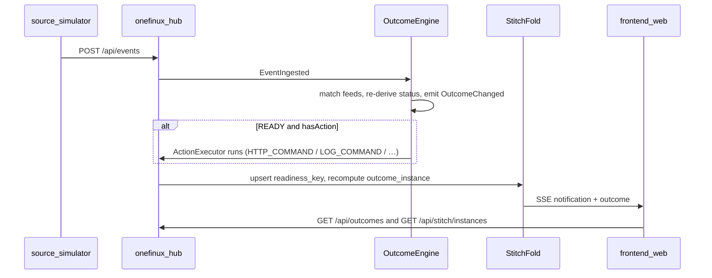

# BRD — One Finance application build

Owner: Praveen Kumar · Status: current as of 14 September 2026 · Companion to `architecture-group.md` and `README.md`.

This is the document a developer picks up to make the console a real product. It covers the two models, who calls whom, when we decide an event, the API surface, how to onboard an outcome, which skill owns which part, and exactly what is in the demo build versus later.

## 1. Modules and ports

| Module | Port | Responsibility |
|---|---|---|
| `onefinux-hub` | 7070 | Event ingest, translation, Outcome Engine fold, Stitch fold, REST + SSE, outbox, audit |
| `source-simulator` | 7081 | Stubs systems of record and destinations. Drives Drive scenarios. |
| `frontend/web` | 7091 (dev) | React console. The product UI. |

The browser talks only to the hub (and `/sim` via the Vite proxy). Nothing in the browser touches a bus.

## 2. Two models — do not collapse them, do extend each

The platform keeps **two complementary models**. They share one event backbone. New capabilities launch on each by configuration, not by a new Java type.

### 2.1 Outcome Engine (business question)

A product is an `OutcomeDefinition`: `id`, `name`, `question`, `regions`, `ownerGroup`, `sla`, `dependencies[]` (feeds), `onReady`.

- Seeded in `application.yml`: `FOBO_HELIX`, `REPORT_15C3`, `PNL_REPORTING`.
- Runtime onboard: `POST /api/outcomes/definitions`.
- Fold: `OutcomeEngine` matches events on `eventType` + `sourceSystem`, re-derives status, emits `OutcomeChanged`.
- On ready: any `onReady.action` other than `NOTIFY_ONLY` is dispatched through the **`ActionExecutor` registry** (`HTTP_COMMAND`, `LOG_COMMAND`, …). Downstream reports back by publishing the completion event. No polling.
- Report-like vs command-like is data: a completion event with `reportId` attaches a `ReportArtifact` and the derived `stage` becomes `AVAILABLE`; otherwise it is `GENERATED`.

Derived stage (generic, not 15C3-specific):

`NOT_STARTED → FEEDS → READY → PROCESSING → GENERATED | AVAILABLE` (or `BLOCKED` / `FAILED`).

### 2.2 Stitch console kit (human work)

A kit is `product_kit` + sources + destinations + embed + `userActions`. FOBO is the first kit. There is no FOBO code path.

- Status vocabulary: instance `NOT_YET | READY | BLOCKED | SIGNED | CLEARED | DELAYED`; readiness key `WAITING | COMPLETED | FAILED | REVOKED`.
- Human actions: `POST /api/stitch/instance/action?id=&action=` is gated by the kit's `userActions`. Known verbs (`SIGN_OFF`, `POST`, `ESCALATE`, `ADJUST`, `COUNTERSIGN`) keep rich behaviour; any other declared verb is handled generically (audit + `WORKFLOW_<VERB>`). Launching a new console capability is adding a verb to the kit.

The console never invents an id. Every dropdown is filled from an API.

## 3. How an event becomes a screen



### When we decide an event (stitch fold)

- any key `FAILED` → **BLOCKED**, named blocker.
- else any key `WAITING` → **NOT_YET** (or **DELAYED** if past SLA).
- else all keys `COMPLETED` and every required source present → **READY**.
- user signs off a READY instance → **CLEARED**.

### When we notify

Notify on: `READY, BLOCKED, DELAYED, SLA_BREACHED, REVOKED, CLEARED, SIGNED_OFF, POSTED, ESCALATED` and kit-declared verbs.
Never notify on: raw facts, PROGRESS ticks, or LLM/advisory output.

## 4. Screens (as built)

| Route | Job | Who |
|---|---|---|
| `/` Home | Today’s close in one paragraph, then the fold | Everyone |
| `/product` | Product story a BU head recognises | Everyone |
| `/architecture` | How facts become Ready or Blocked — same diagrams as `docs/design` | Everyone |
| `/guide` | Developer on-ramp: run it, add an outcome as data, review a PR | Engineer |
| `/onboarding` | **Create** a live OutcomeDefinition (question, feeds, SLA, on-ready) | Maker |
| `/configuration` | **Govern**: master-detail registry of outcomes and kits | Owner / config |
| `/drive` | **Testing**: run a COB scenario. Product pages stay view-only. | Demo / QA |
| `/reports` | Report lifecycle + predicted ready; Normal / Compact / Table | Controller |
| `/reports/:outcomeId/:cobDate/:region` | Produced report document; Grid view for lineage FlexGrids | Controller |
| `/board` | **Management**: traffic lights for the unit (CIO / MD / BU head) | Head — read only |
| `/outcomes` | **My outcomes**: card worklist; open to act | Outcome user |
| `/instance/:id` | Fold and destinations first; Partner view and Grid view on demand; sign-off / post / kit-declared actions | Outcome user |
| `/operations` | Escalations, watermarks, dead letters, dual-control replay | RTB |
| `/monitoring` | Received → persisted → propagated → audited | RTB / engineering |

**Outcome board vs My outcomes.** Same tenant-scoped instance list. Board is the supervisor table (status filter, blockers, escalation counts). My outcomes is the doer's card worklist. Both drill to Instance detail.

**Onboarding vs Configuration.** Onboarding *creates*. Configuration *inspects and governs* (pick an outcome or kit on the left; anatomy on the right).

**Views.** The top-bar View select persists `localStorage['ofx-view']`: `all`, `developer`, `architect`, `controller`, `head`, `rtb`, `maker`. A view filters the rail. It is not CEES and it is not a Home panel. Guide pages (`/product`, `/architecture`, `/guide`) stay on the rail in every view. New-developer write-up: `start.md` and `/guide`.

**Mobile.** Below 820px the left rail is an overlay drawer (hamburger in the top bar). A labelled bottom nav (five primary destinations) is the primary way to move; the rest stay in the drawer. Grids stack. The top-bar filters and the context ribbon each sit on one swipeable row. Below 640px the Board and Home instance tables become one card per row so status stays on screen; other tables swipe sideways. On a phone the report flow stacks vertically. The management board and My outcomes are the first surfaces intended for a phone between meetings.

## 5. API surface

Stitch (`/api/stitch`) — kits, instances, sign-off, post, escalate, generic `POST /instance/action`, `GET /instance/step-view` (GRID from events or a configured endpoint, or IFRAME), RTB, reset.

Outcomes (`/api/outcomes`) — live views, `GET/POST /definitions`, instance + report document.

Events (`/api/events`) — ingest (JSON Schema validated). Stream (`/api/stream`) — SSE.

Workflow (`/api/workflow/.../run`) — re-run an on-ready action.

Simulator (`/sim/scenarios/{name}`) — `fobo`, `helix`, `15c3`, `pnl`, `restate`, `all`, `cancel`.

## 6. Onboard a product (ready-to-use)

### Outcome (engine)

`POST /api/outcomes/definitions` with id, name, question, regions, owner, SLA, feeds, on-ready. The instance appears on Board, Reports and Configuration for the given COB.

### Console kit (stitch)

`POST /api/stitch/kits` with kitId, sources, destinations, embed, `userActions`. No new Java type.

Full operator steps: `onboarding.md`.

## 7. Which skill owns which part

| Part | Skill |
|---|---|
| Console chrome / theme / mobile | `barclays-ib-console` |
| Create / register an outcome or kit | `register-outcome-kit` |
| Outcome Engine fold + ActionExecutor | `outcome-engine` |
| Drive a COB scenario / exec demo | `drive-and-demo` |
| Configuration / bindings | `engineering-view` |
| CIO / MD board | `bu-head-view` |
| Sign-off / post / amend | `colleague-view` |
| Delays / escalations / dead letters | `rtb-support-view` |
| Bind a source or destination | `bind-source-destination` |
| Partner iframe | `embed-partner-screen` |
| Analyst grid | `wijmo-outcome-grid` |

## 8. Demo build vs later

**In (working product slice):** React console; Outcome Engine with runtime onboard; Drive; Configuration master-detail; 15C3 report flow; FOBO stitch console with kit-declared actions (`AMEND`, `ADJUST`, `COUNTERSIGN`); accounting item on Board; RTB operations; monitoring + outbox + audit; solid finance-dashboard theme (MITR indigo-lavender); pluggable action registries.

**Later:** bank Kafka/Solace and real FEED watermarks; live CEES; live Helix/FAS/Axiom; Barclays Now; Wijmo analyst studio; native mobile app wrapping the same responsive shell.

## 9. Run and verify

Numbered local run (full list in the repo `README.md`):

1. `./scripts/run.sh` — hub **7070** (API) + simulator **7081**. Not the UI.
2. Separate terminal: `cd frontend/web && npm install && npm run dev` — console **http://localhost:7091**.
3. Open `/drive`, click **Reset**, then drive one scenario. Watch Board and Reports.

```bash
curl -s -XPOST http://localhost:7070/api/stitch/reset
curl -s -XPOST http://localhost:7081/sim/scenarios/fobo
```

Drive lives at `/drive`. Do not put scenario buttons on Home or Reports. Docker: `docker compose up --build` then console **http://localhost:8080**.
