# Architecture Q&A — slide source

Owner: Praveen Kumar · Audience: CEO / CIO / architecture group  
Use this file to **build your own deck**. One section = one slide. Copy the title, say the paragraph, paste the mermaid (PowerPoint, Gamma, Notion, Mermaid Live, etc.).

Companions if you need more depth: `architecture-group.md` (problem + two models), `build-vs-buy.md` (full FAQ), `executive-brief.md` (value + ask), `helix-walkthrough.mp4` (working product).

---

## The argument in six lines

1. The close question is **“is it safe to run this yet?”** That answer is scattered across Motif, CATS, MBR, Helix, SAP.
2. We build a **thin on-prem outcome layer** that folds facts into Ready / Blocked / Delayed, commands once, entitles fail-closed, and audits the human step.
3. We **reuse** Motif, Helix, CEES, Oracle, and any bus the bank already paid for. We do **not** replace them.
4. Kafka, SNS/SQS, Lambda, Redis, Airflow, Power BI, ServiceNow are **adjacent tools**. They move, cache, schedule, or ticket. They do not decide Ready.
5. **Phase 1 is the app as-is**: HTTP `POST /api/events`, H2, three processes. No Kafka, Redis, or AWS required.
6. Next outcome is **data** (`POST /api/outcomes/definitions`). First production outcome: FOBO.

**Ask of the room:** endorse the fold as the only Ready / Blocked system of decision. Reuse the estate. Stay thin.

---

## Slide 1 — Title

**Title:** One Finance — a thin on-prem outcome layer

**Say:** We are not asking for a platform programme or a cloud account. We are asking to standardise one decision layer on systems the bank already has. It subscribes to facts. It does not replace Motif or Helix.

**Draw:**

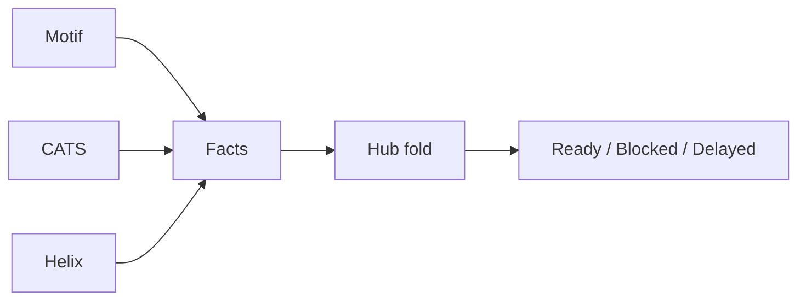

**Keep on the slide:** Phase 1 runs as-is. No new broker licence. No new cloud bill.

---

## Slide 2 — The ask

**Title:** Endorse the fold. Reuse the estate.

**Say:** The room is asked to name **one** system of decision — not to buy a stack. The bus, books, and rec stay where they are. First production outcome is FOBO. The next outcome is a row of data, not a release.

**Draw:**

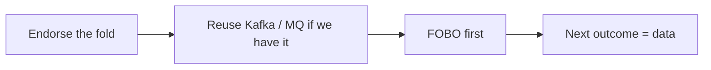

**Minute these four:**

1. Build hub + entitled console in-house.
2. Reuse Kafka / Solace / IBM MQ if they exist. Do not buy AWS to get a close.
3. First production outcome: FOBO (Helix on Reports + rec on the Board). CEES fail-closed.
4. Non-goals stay binding so the layer stays thin.

---

## Slide 3 — The problem

**Title:** The answer is scattered

**Say:** At close of business a group unit has to answer one question per outcome: *can I run this rec / report / book yet?* Today that lives in five screens and five status words. People chase. Closes run late. Audit asks who knew — nobody holds the picture.

**Draw:**

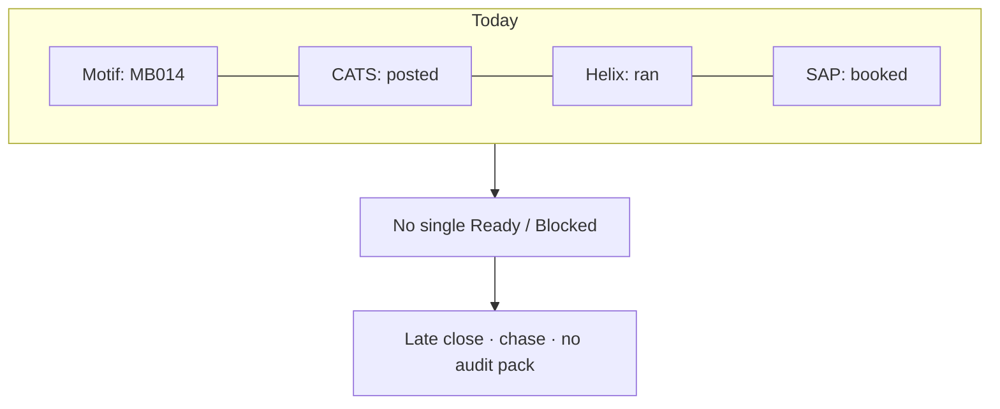

**If they push back:** “we already have Motif / Helix screens” — those screens answer *their* word for done. They do not stitch Motif + CATS + Helix into one entitled row.

---

## Slide 4 — What we build vs what we reuse

**Title:** Build the decision. Reuse the pipes.

**Say:** The product is the fold and the entitled board. Books grids, rec screens, brokers, and warehouses stay the systems of record.

| We build | We reuse | We never |
|---|---|---|
| Ingest a fact | Motif, Helix, CATS, CEES | Rebuild books grids |
| Distinct-key fold | Kafka / MQ already paid | Kafka in the browser |
| Command **once** when READY | Oracle | `if (FOBO)` in Java |
| 404 if the row is not entitled | Airflow **after** READY | LLM on Ready / Blocked |
| Audit the human step + one board | | |

**Draw:**

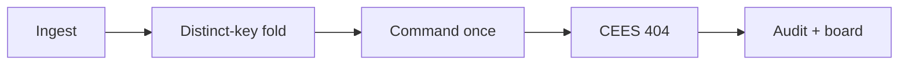

---

## Slide 5 — Category error

**Title:** They move bytes. We decide Ready.

**Say:** A topic offset, a queue receipt, or a cache key proves produce / consume. It does not name *R-2031 BLOCKED on MB014*, ignore a stale run, or 404 an unentitled row.

**Draw:**

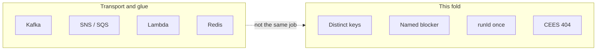

| They name | Good at | Not a close |
|---|---|---|
| Kafka / IBM MQ / AMQ | Durable log, fan-out | An offset is not BLOCKED on MB014 |
| SNS + SQS / Service Bus | Queues and pub-sub | A receipt is not Ready |
| Lambda / Functions | Glue and burst compute | Re-implements the hub, off-prem |
| Redis | Cache | Second truth if it owns Ready |
| Airflow / Control-M | Batch **after** READY | Polling Motif recreates the late close |
| Power BI / Fabric | Yesterday’s MI | Not a command + sign-off |

---

## Slide 6 — Kafka / IBM MQ / ActiveMQ

**Title:** Use the bus. Do not confuse it with the fold.

**Say:** A message on `motif.book.lifecycle` proves the producer wrote and the consumer read. FOBO still needs distinct books, a named blocker, and **one** Helix POST with a run id. Keep the broker. Put a thin adapter in front of the same API. The browser never talks to the bus — REST + SSE only.

**Draw:**

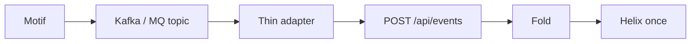

**If they push back:** “Kafka already stores 300 MASTERBOOK_READY” — yes. The hub **counts distinct keys**, then POSTs Helix **once**. That consumer *is* this product.

---

## Slide 7 — AWS SNS, SQS, Lambda (and Azure equivalents)

**Title:** Cloud messaging is not an outcome layer

**Say:** SNS, SQS, EventBridge, Event Grid, and Service Bus have the **same gap as Kafka**: they move facts. Lambda or Step Functions rewrite this hub as billed invocations at COB burst — and the close keys leave the bank. That is the wrong control plane.

**Draw:**

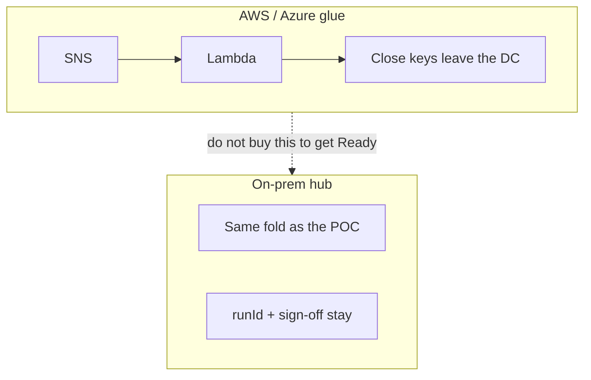

**If they push back:** “we could run it in our VPC” — you still added a second IAM plane and a burst bill to re-implement a fold we already have on-prem.

---

## Slide 8 — Redis

**Title:** We do not use Redis. We do not need it.

**Say:** The fold is event-sourced. Replay the store and Ready / Blocked comes back. Putting that answer in Redis creates a **second truth** the moment a node fails over.

**Draw:**

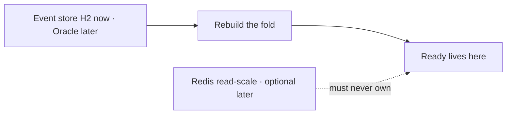

**Phase 1:** no cache licence. Optional later = read-scale only. Never the system of decision.

---

## Slide 9 — Airflow / Control-M

**Title:** Batch after READY. Never instead of READY.

**Say:** A scheduler is good at warehouse loads and file drops **after** the light is green. If it polls Motif to decide Helix, you have rebuilt the late close inside a DAG.

**Draw:**

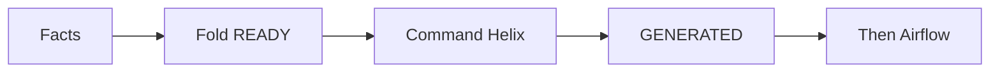

| If | Airflow alone | This fold |
|---|---|---|
| Same book twice | Easy to double-count | Distinct `sourceKey` |
| Book 147 fails | Generic job error | Named blocker; RTB replay |
| Old Helix run | Can land on today | Stale `runId` ignored |
| Motif 20s late | Next poke, often minutes | Event updates now |
| Next outcome | New DAG | `POST /definitions` — data |

---

## Slide 10 — “Can’t we do phase 1 with zero new code?”

**Title:** There is no zero-code substitute

**Say:** ServiceNow, Power Automate, and n8n can land a ticket. A vendor control-tower RFP can copy screens into a lake. Neither folds distinct keys, ignores a stale run id, nor 404s an unentitled row. Zero new **hub** code means N shadow folds — spreadsheets, DAGs, dashboards — not a saving.

**Draw:**

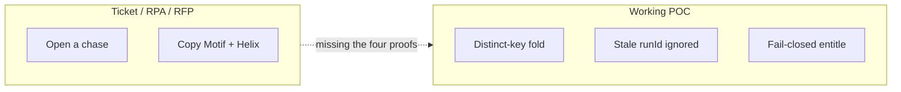

---

## Slide 11 — Use it as-is

**Title:** Yes. That is the cheapest path that works.

**Say:** Phase 1 is the app you can run today: hub `:7070`, console `:5173`, simulator `:7081`. Origins POST JSON. Same JSON Schema in production. No Kafka, no Redis, no AWS account.

**Draw:**

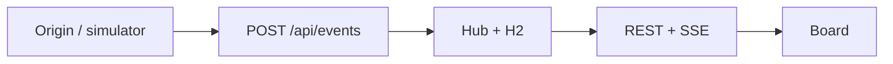

| Piece | Phase 1 | Later, only if already owned |
|---|---|---|
| Ingest | `POST /api/events` | Thin adapter from Kafka / MQ |
| Fold + board | This hub | Unchanged |
| Cache | None | Redis read-only |
| Batch | None | Airflow after READY |
| Persistence | H2 | Oracle on the estate |

---

## Slide 12 — Later mix (optional)

**Title:** If the bank already owns a bus, plug it in

**Say:** The fold does **not** change when Motif writes a topic instead of HTTP. Production is a thin adapter plus a real Helix URL. Completion is another fact with the same `runId`. Do not introduce a bus to justify the product.

**Draw:**

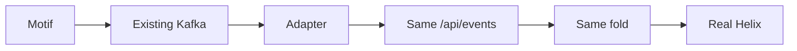

Airflow may load a warehouse **after GENERATED**. It may not poll Motif to decide Helix.

---

## Slide 13 — Why on-prem

**Title:** The close stays in the bank

**Say:** Ready / Blocked, run ids, and who signed are the **control plane of the close**. They belong in the DC next to Motif, CEES, and Oracle — not in a second cloud IAM plane.

**Draw:**

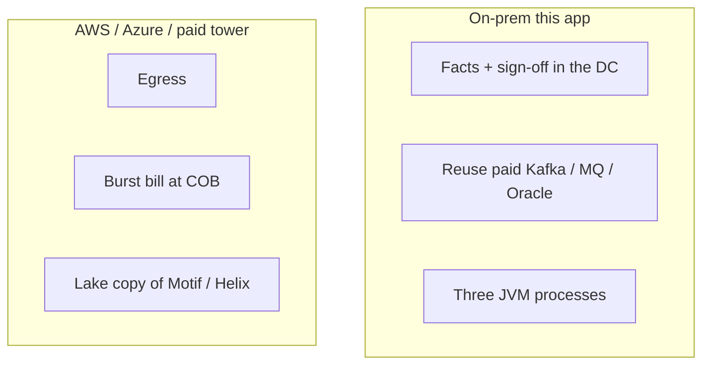

A paid control-tower that copies books into a lake is the opposite of subscribe-don’t-replace.

---

## Slide 14 — Cost

**Title:** Build once. Or pay forever in copies.

**Say:** The alternative is not zero code. It is FOBO in a spreadsheet, 15C3 in Control-M, PnL in a checklist, RTB in tickets — four answers that drift the first night SAP double-posts. One SAP fact must feed two outcomes without being counted twice. Only a **shared** fold does that.

**Draw:**

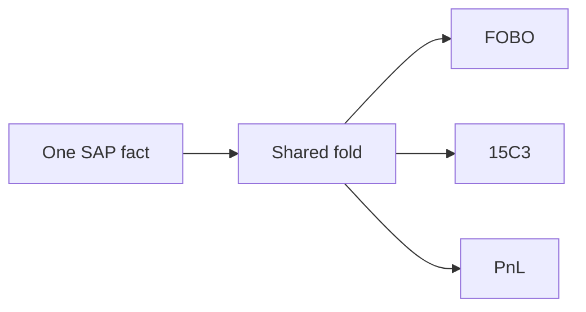

Value levers (plug in real numbers): controller minutes, SLA misses, rework, audit packs — `executive-brief.md` §4.

---

## Slide 15 — Generic by design

**Title:** The next use case is a row, not a release

**Say:** An outcome is a question + feeds + SLA + on-ready command. A kit is sources + destinations + embed + verbs. FOBO is the first row. There is no `if (FOBO)` in Java. New command type = one `ActionExecutor` bean. New kit verb = data.

**Draw:**

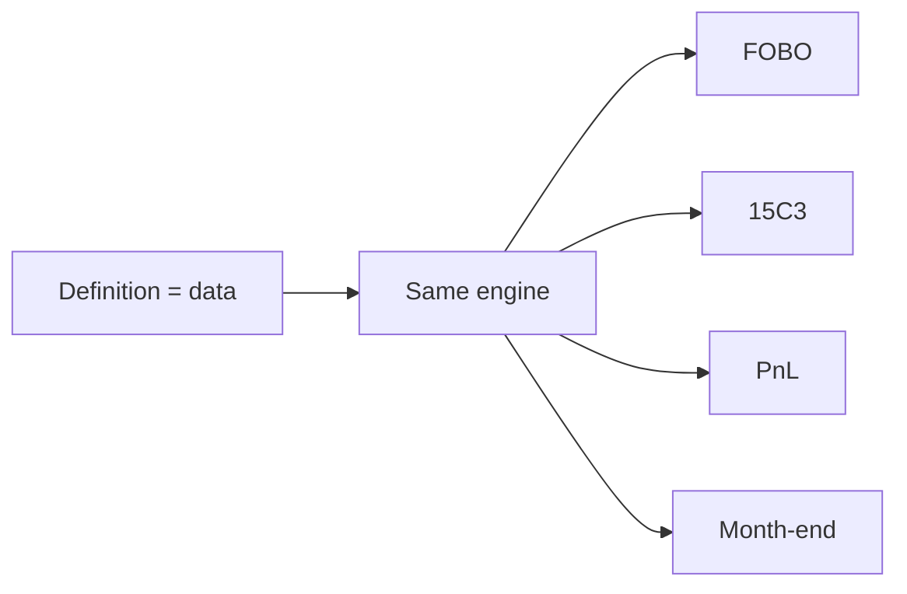

Onboard the next group unit with `POST /api/outcomes/definitions`.

---

## Slide 16 — What we refuse

**Title:** Stay thin

**Say:** This layer dies when it becomes a second Motif, a second Helix, or a second bus. Thickness is the failure mode. Stay a subscriber.

**Do not build:** Kafka / Solace brokers · Motif books grid · Helix recon clone · CEES replacement · second mobile product · LLM on Ready / Blocked.

**Draw:**

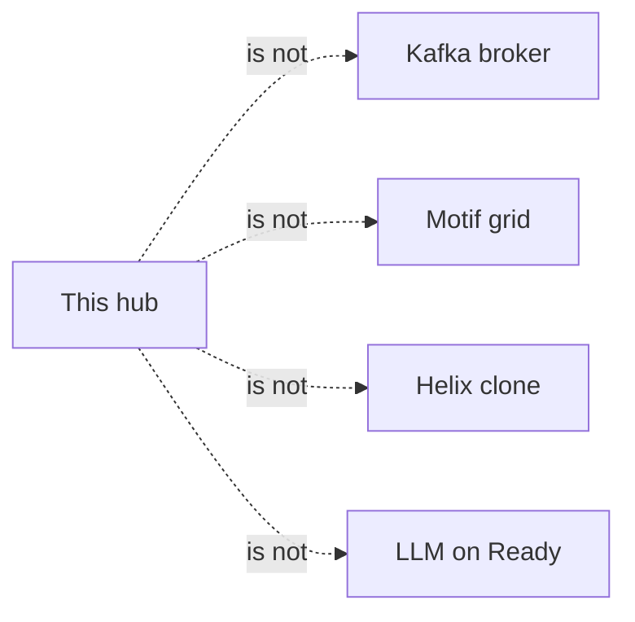

---

## Slide 17 — Minute this

**Title:** Six lines for the minutes

1. Subscribe to facts. Do not replace systems of record.
2. Reuse the bus the bank already has. Airflow only after READY.
3. This hub is the only Ready / Blocked system of decision.
4. Ingest stays the POC contract. Next origin is an adapter.
5. First production outcome: FOBO. CEES fail-closed.
6. Non-goals stay binding so the layer stays thin.

---

## Slide 18 — Evidence (point at the product, not the slide)

**Title:** Four proofs a replacement must show

A counter-proposal is a replacement only if a **running system** can show all four. Missing one is a bus, a DAG, or a dashboard.

| Proof | Where |
|---|---|
| Distinct keys, FAILED blocks, stale `runId` ignored | `OutcomeEngineTest` |
| Drive FOBO → Reports GENERATED 300/300 | Live console + `helix-walkthrough.mp4` |
| Next outcome onboarded as data | `/onboarding` → `POST /api/outcomes/definitions` |
| Unentitled row is 404, not 403 | `StitchController` |

---

## Extra objections (keep off the main 18; use if asked)

Full answers live in `build-vs-buy.md` §7.

| They say | You say |
|---|---|
| Wait for a vendor control-tower RFP | The close is running now. An RFP does not stitch REV-ACC tomorrow. |
| This is an ESB / canonical model | We own a fact envelope and a fold. Origins stay origins. |
| Flink can count 300 books | Then you still need SLA, command, run-id, CEES, sign-off, UI. Flink is optional acceleration **inside** the hub. |
| Temporal / Camunda is the pattern | Those orchestrate activities. The activities **are** this hub. |
| CEES + a portal can show a light | A portal shows a colour. Someone still has to compute it and entitle the act. |
| Fabric / Databricks on the Kafka lake | Yesterday’s MI. The controller’s question is this COB, this minute. |
| Palantir can build the app | Usually by copying data. This plan is subscribe, don’t replace. |
| Duplicate of notifications / Barclays Now | Notifications are a channel. The fold is the source of truth. |
| ksql already has a “ready” table | That table is an unofficial, unentitled fold. Promote it here or debug two truths every COB. |
| Another runtime to operate | One small process that rebuilds from the event store. Cheaper than N Airflow pools doing the same wait. |

---

## Phase 1 vs production (keep in the appendix)

```
Phase 1 (as-is, cheapest path that works)
  Origin/simulator --HTTP--> hub:7070 --SSE--> console:5173
  Store: H2     Bus: none     Cache: none     Cloud: none

Production (only if the estate already has a bus)
  Motif --Kafka/MQ--> thin adapter --same POST /api/events--> same hub
  Store: Oracle     Helix: real URL     CEES: fail-closed
  Airflow: after GENERATED only
```

Three processes today. Simulator dies in production. The fold does not change.
