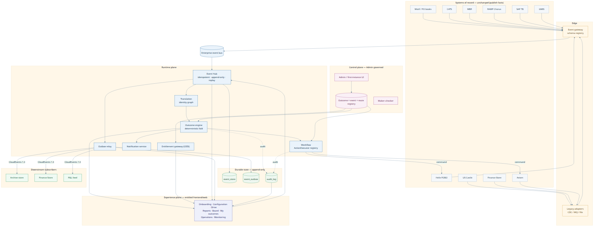
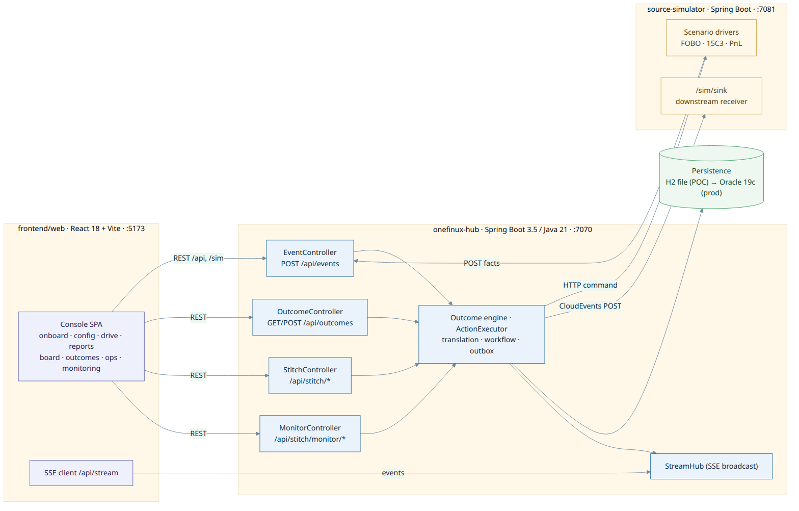
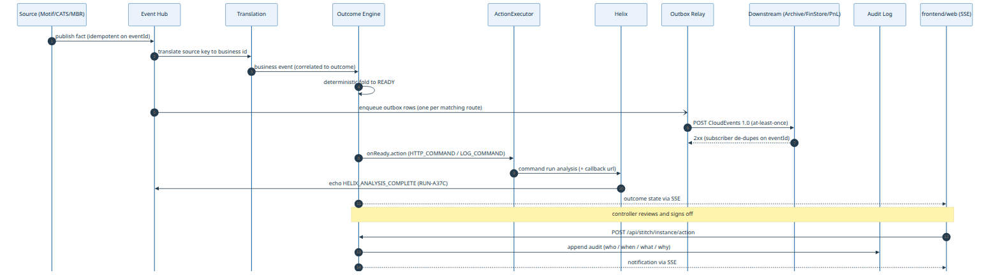
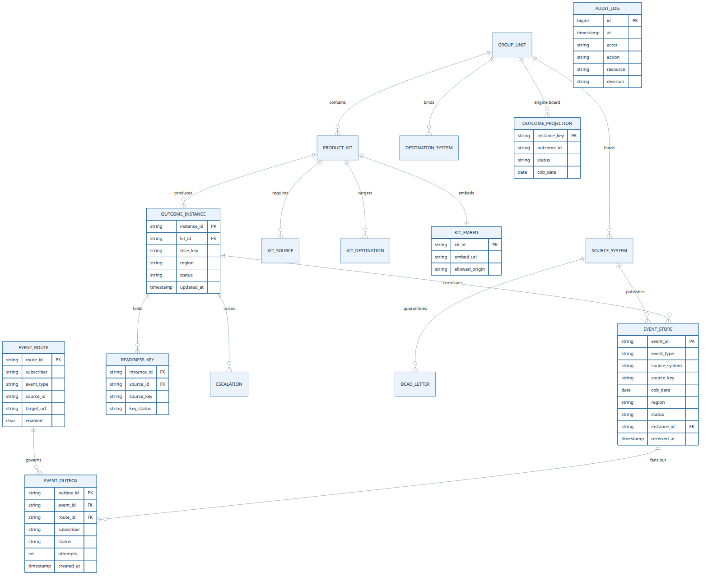
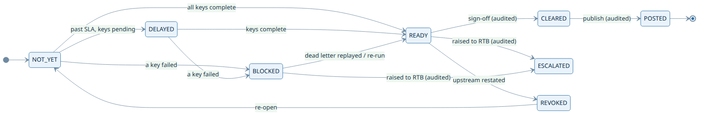
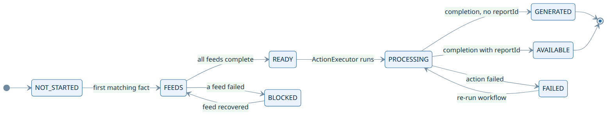

# Architecture diagrams

One final set. Source of each chart is the `.mmd` file; SVG/PNG are exports (`diagrams/render.sh`). Do not treat the exports as a second design.

Live visual truth is `frontend/web`. The same diagrams and write-up are on the console at **`/product`**. Product write-up: [`as-built.md`](as-built.md).

| # | Diagram | What it shows |
|---|---|---|
| 1 | [Enterprise context](diagrams/01-enterprise-context.png) | Unchanged systems of record → hub → entitled `frontend/web` |
| 2 | [Deployment](diagrams/02-deployment-containers.png) | Console · hub · simulator |
| 3 | [Event sequence](diagrams/03-event-sequence.png) | Fact → fold → `ActionExecutor` → SSE |
| 4 | [Data model](diagrams/04-data-model.png) | Stitch kit + engine projection |
| 5 | [Stitch states](diagrams/05-outcome-state.png) | Human kit: `NOT_YET` → `READY` → `CLEARED` |
| 6 | [Engine stages](diagrams/06-engine-stage.png) | Report lifecycle: `NOT_STARTED` → `AVAILABLE` |

