# One Finance UX — Executive Brief

*For an MD / CIO audience. One page of narrative, one page of value, one page of architecture and roadmap. Everything here is backed by the working demo — nothing is a slideware promise.*

---

## 1. The problem, in one sentence

Every day, controllers cannot answer a simple question — **"Is it safe for me to run my process yet?"** — without chasing a dozen systems (Motif, CATS, MBR, Helix, SAP, GMIS, RAMP, US Castle, Finance Store, Axiom), each with its own screen, status, and language.

The cost of that gap: **late closes, missed SLAs, manual reconciliation, and audit findings** — because the truth is scattered and nobody holds the whole picture.

## 2. What One Finance UX is

A thin **outcome layer** that sits on top of the existing estate. It does **not** replace any system of record. It:

- **Listens** to the facts each system already emits ("ledger posted", "break cleared", "analysis complete").
- **Stitches** those facts into a single business answer per outcome: *Ready / Blocked / Delayed / Signed-off*.
- **Acts** on the human's behalf when ready (e.g. "trigger Helix analysis") and waits for the system to report back — no polling.
- **Governs** every step: entitlement-scoped, SLA-tracked, escalation-aware, and now **fully audited and propagated** to downstream systems.

The headline question it answers on screen: **"Can I execute FOBO analysis?"** — and the board turns green, amber, or red with the named reason.

## 3. What an executive will see in the demo (all live)

| Screen | The executive takeaway |
|---|---|
| **Home** | One shell, traffic lights per outcome. "This is the controller's morning in a single glance." |
| **Outcome board** | Ready / Blocked / Delayed with the *named* blocker (`R-2031 blocked — MOTIF MB014 ledger rejected`). "The system tells you *why*, not just *that*." |
| **Instance detail** | The fold of source facts into one outcome, with sign-off. "Full lineage from raw fact to business decision." |
| **Operations (RTB)** | Escalations, dead letters, feed watermarks, dual-control replay. "Run-the-bank has its own cockpit; nothing is lost." |
| **Monitoring** | Received → persisted → propagated → audited, live. "Every fact is stored once and pushed to other systems reliably, with a full audit trail." |
| **Onboarding** | Create a live outcome (question, feeds, SLA, on-ready). "We onboard the next business without a release." |
| **Configuration** | Master-detail registry of every outcome and kit. "The owner inspects the contract — Onboarding creates, Configuration governs." |
| **Drive** | Start the day's scenario for a COB. "Product pages stay clean; testing lives here." |
| **Reports** | Good path: feeds → ready → processing → generated → available to view. |

## 4. The value (framework — plug in your numbers)

The platform creates value on four levers. The formulas are ready; the **illustrative** figures below are placeholders to be replaced with your real operating data.

| Lever | How it pays back | Illustrative model *(replace)* |
|---|---|---|
| **Controller time** | Removes the daily "chase the status" hunt across systems | `controllers × outcomes/day × minutes saved × cost/min` → *e.g. 40 × 6 × 12 min ≈ 48 hrs/day reclaimed* |
| **SLA / late-close risk** | Early amber/breach alerts + named blockers cut misses | `SLA misses/month × cost per miss × % reduction` |
| **Reconciliation & rework** | One stitched truth reduces manual break-chasing | `breaks/COB × handling time × % avoided` |
| **Audit & control cost** | Append-only audit log + replay = evidence on demand | `audit prep hours/quarter × % reduction` |

> These numbers are **not** claims — they are a model. Give me your controller count, outcomes/COB, average manual minutes, and current SLA-miss rate and I will turn this into a credible before/after.

## 5. Architecture at a glance (CIO view)

The full, editable diagram set (Mermaid source + SVG/PNG exports) lives in **[`architecture.md`](./architecture.md)**: enterprise integration context, deployment/containers, end-to-end event sequence, data model (ER), and the outcome state machine. The enterprise integration context is below.

> Every diagram is real Mermaid you can fork ([`diagrams/*.mmd`](./diagrams)) and re-render with [`diagrams/render.sh`](./diagrams/render.sh) — nothing here is a hand-drawn picture that can drift from the build.

**Why a CIO can say yes:**

- **No rip-and-replace.** Systems keep their data; we subscribe to facts. Integration is a lightweight adapter, not a migration.
- **Event-driven, two-way, no polling.** Systems tell us when they're done; we can tell them to start.
- **Resilient by construction.** Idempotent ingest (safe retries), **transactional outbox** for at-least-once propagation, **replay-to-rebuild** state, and an **append-only audit log**.
- **Open standards.** Facts are propagated as **CloudEvents 1.0** envelopes.
- **Entitlement-aware.** Every artefact is scoped to CEES; the production contract is **fail-closed** (unentitled → 404, not 403).
- **Deterministic.** The outcome fold is rules-based and explainable — critical for a regulated close.

## 6. Where we are, and what's next

| Phase | Status |
|---|---|
| **Now (demonstrable today)** | Working event hub, outcome engine, RTB ops, entitlement-scoped console, **monitoring + outbox propagation + audit log**, FOBO/15C3/PnL worked examples, onboarding-as-data. |
| **Next** | Real CEES entitlements (fail-closed), maker-checker on commands, effective-dated reference data, Oracle persistence, the enterprise event bus, and NFR hardening (throughput/latency/DR evidence). |
| **Later** | Analyst explorer at scale, AI assistance (agents read the event store to predict ETAs and explain bottlenecks; the engine stays deterministic). |

Details: `architecture-group.md` (scope line §6, non-functionals §7).

## 7. The ask

1. Endorse the **outcome-layer approach** (subscribe to facts, don't replace systems).
2. Sponsor the **first production outcome** (FOBO) end-to-end with real CEES entitlements.
3. Agree the **integration pattern** as the standard for the next outcomes (15C3, PnL, Month-End Close).

## 8. CIO deep-dive FAQ (be ready for these)

- **"How does a custom system like Helix integrate?"** It publishes a fact to `POST /api/events` and echoes command completions the same way; heavy recon data stays in Helix, we hold the fact + a deep-link. (See `application.md` §3.)
- **"What if a downstream system is down?"** The outbox holds the fact and the relay retries; failed rows are visible and re-queueable on the Monitoring screen. Delivery is at-least-once; subscribers de-dupe on event id.
- **"How do we prove what happened?"** Append-only audit log (who/when/what/why) plus the immutable event store; replay rebuilds state from history.
- **"Security?"** Entitlement fail-closed contract; the local demo ships a fail-open stub for convenience only.
- **"Scale?"** Architecture is bus-ready and stateless-per-fold; production NFR evidence (throughput/latency/DR) is the next hardening step.
