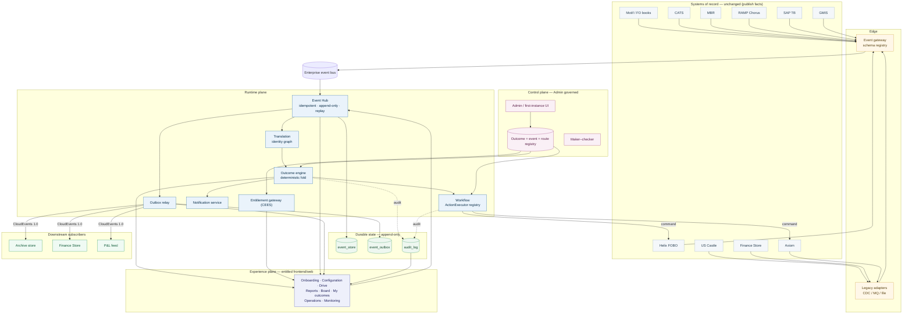
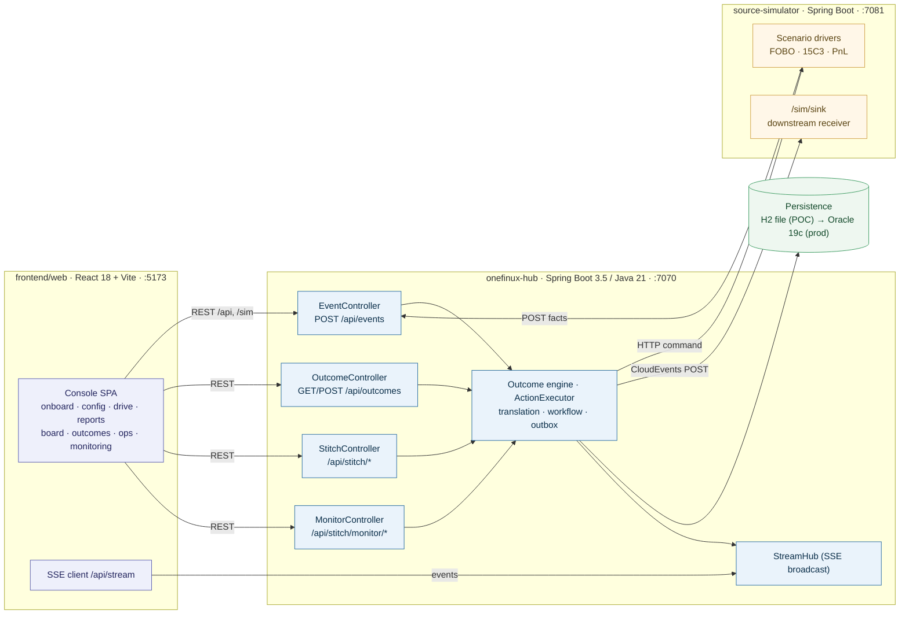
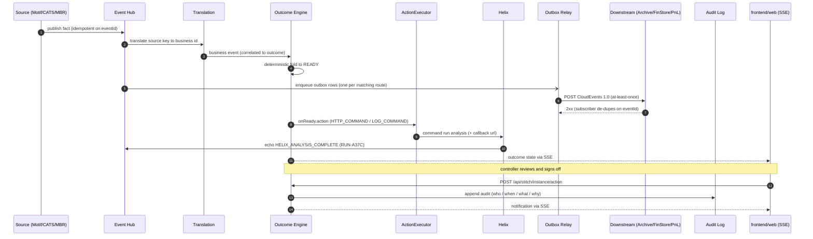
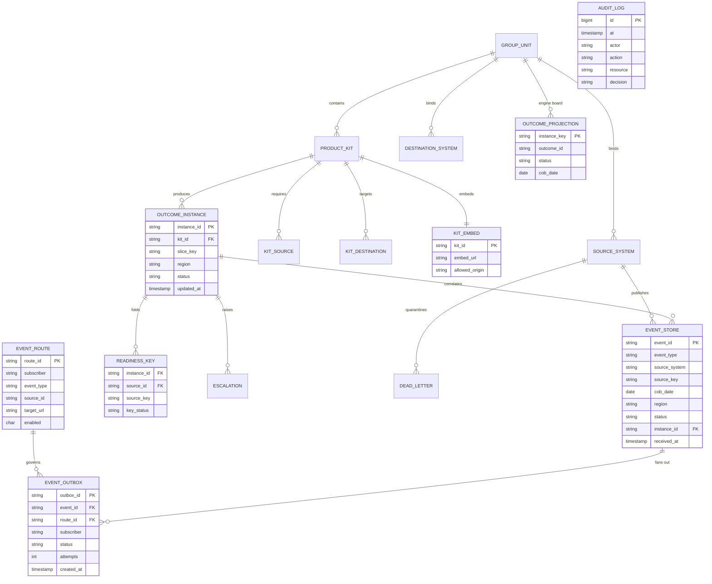
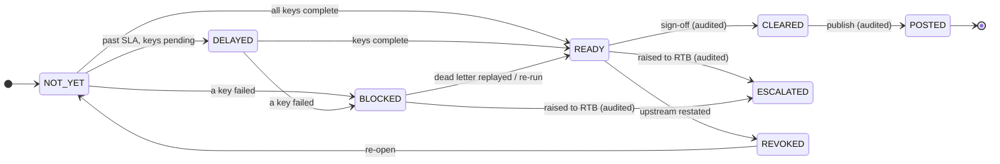
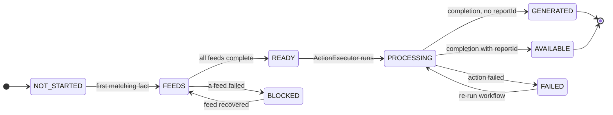

# One Finance UX — Architecture Diagrams

Proper, source-controlled **Mermaid** diagrams. They render natively on GitHub (below), and are also exported to crisp **SVG** (scalable, for slides) and **PNG** (2×) under [`diagrams/`](./diagrams). Edit the `.mmd` source and re-run [`render.sh`](./diagrams/render.sh) to regenerate.

These diagrams match the as-built product: `frontend/web`, the two models (Outcome Engine + stitch kit), the live console routes, and the `ActionExecutor` registry. Static HTML under `docs/design/mockups/` and `docs/design/dreamliner/` is the earlier visual reference, not the live console.

| # | Diagram | Source | Exports |
|---|---|---|---|
| 1 | Enterprise integration context | [`01-enterprise-context.mmd`](./diagrams/01-enterprise-context.mmd) | [svg](./diagrams/01-enterprise-context.svg) · [png](./diagrams/01-enterprise-context.png) |
| 2 | Deployment / containers | [`02-deployment-containers.mmd`](./diagrams/02-deployment-containers.mmd) | [svg](./diagrams/02-deployment-containers.svg) · [png](./diagrams/02-deployment-containers.png) |
| 3 | End-to-end event sequence | [`03-event-sequence.mmd`](./diagrams/03-event-sequence.mmd) | [svg](./diagrams/03-event-sequence.svg) · [png](./diagrams/03-event-sequence.png) |
| 4 | Data model (ER) | [`04-data-model.mmd`](./diagrams/04-data-model.mmd) | [svg](./diagrams/04-data-model.svg) · [png](./diagrams/04-data-model.png) |
| 5 | Stitch kit state machine | [`05-outcome-state.mmd`](./diagrams/05-outcome-state.mmd) | [svg](./diagrams/05-outcome-state.svg) · [png](./diagrams/05-outcome-state.png) |
| 6 | Outcome Engine stages | [`06-engine-stage.mmd`](./diagrams/06-engine-stage.mmd) | [svg](./diagrams/06-engine-stage.svg) · [png](./diagrams/06-engine-stage.png) |

---

## 1. Enterprise integration context

How One Finance UX sits over an unchanged estate: sources publish facts through the edge/gateway onto the event bus; the runtime plane persists, translates, folds, acts, propagates and audits; the control plane governs; the entitled console is `frontend/web`.

---

## 2. Deployment / containers

The three deployables in the POC and how they talk. Persistence is H2 (file) for the POC and Oracle 19c in production. The console lives in `frontend/web`.

---

## 3. End-to-end event sequence

A fact's full journey — receive → translate → fold → act (`ActionExecutor`) → propagate (outbox) → audit → notify. No polling anywhere.

---

## 4. Data model (ER)

The append-only spine plus the as-built stitch kit (`kit_destination`, `kit_embed`, `readiness_key`) and the engine board snapshot (`outcome_projection`).

---

## 5. Stitch kit state machine

Human work on a console kit instance (`outcome_instance.status`). Sign-off, publish and escalate are audited; upstream restatement revokes readiness.

---

## 6. Outcome Engine stages

Derived `stage` on an engine outcome (`OutcomeInstance.stage()`). Report-like completions with a `reportId` become `AVAILABLE`; otherwise `GENERATED`.

