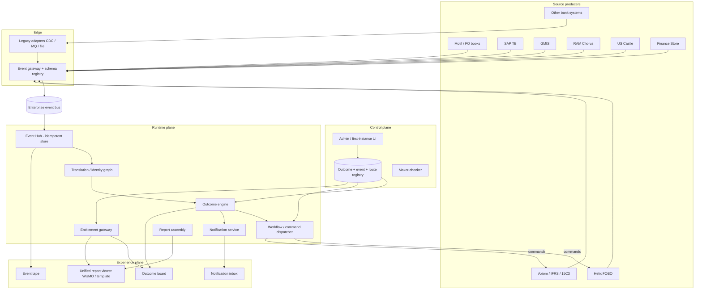

# One Finance UX — Enterprise Event Platform Design

**Status:** proposed  
**Date:** 2026-09-12  
**Audience:** Revenue Accounting, Product Control, Regulatory Reporting, enterprise architecture, and platform engineering  
**Based on:** the current POC in this repository (`onefinux-hub`, `source-simulator`, `contracts/business-event.schema.json`) and the production sketch already in `README.md`

---

## 1. Purpose

Build a bank-wide, event-driven platform that answers business questions instead of system questions.

Today a controller, product-control analyst, or regulatory reporter has to ask:

- “Is Motif complete?”
- “Is SAP trial balance posted?”
- “Has US Castle finished BATCH-03?”
- “Can Helix run FOBO for this rec?”
- “Is the 15C3 / IFRS pack ready, and can I open it?”

The platform replaces that scavenger hunt with a single, entitled view:

- **“Can this front-office / back-office reconciliation (FOBO) be processed?”**
- **“Can I produce the 15C3 report?”**
- **“Can I produce the IFRS pack?”**
- **“The report is ready — open it here.”**

One Finance UX is **not** a replacement for Helix, Axiom, Motif, SAP, GMIS, RAM, US Castle, or Finance Store. Those systems remain systems of record. One Finance is the **outcome orchestrator, event bus citizen, entitlement-aware UX, and unified report surface**.

---

## 2. Problem

Revenue Accounting sits at the join of front-office books, back-office ledgers, and regulatory / management reports. The work is real and time-boxed, but the facts that decide whether work can start are scattered:

| Need | What exists today | Gap |
|---|---|---|
| FOBO rec for a set of books | Helix (or equivalent) processes the rec; Motif (or equivalent) owns book readiness | No shared answer to “do I have all 100 books, or only 80?” |
| Trial balance / 15C3 / IFRS | SAP, US Castle, Finance Store, Axiom each know their own feed | User must poll every system; downstream engines also do not know they may start |
| Report consumption | Each system has its own UI, file drop, and entitlement model | No unified “open this report” experience; no common entitlement check |
| Bank-wide reuse | Each division builds point-to-point checks | Same pattern (inputs → readiness → action → artifact) is reinvented |

The last spoken requirement was cut off (“…for FOBO systems, there is a chance that these can be…”). This design treats that as: **FOBO results can fail, produce breaks, be restated, or be entitlement-gated**. Helix still owns the rec. One Finance decides *when* Helix may run, records the result, and surfaces breaks / the report under the caller’s entitlements.

---

## 3. What the POC already proved (keep this)

The POC is a correct kernel. Enterprise scale **generalizes** it; it does not replace the rules.

| Rule | Why it must survive |
|---|---|
| Every state change is an event, including hub decisions (`WORKFLOW_ACTION_TRIGGERED`, `WORKFLOW_OVERRIDE`, `WORKFLOW_SLA_BREACHED`) | Restarts, audits, and disputes reconstruct the same truth |
| Readiness counts **distinct keys**, never messages | Re-sends are safe; 80 unique books is 80, not 800 retries |
| `COMPLETED` counts; `FAILED` blocks; `REVOKED` withdraws from every dependent outcome | Restatements and late failures are first-class |
| Downstream completions must echo `runId` | Late results from a superseded Helix / Axiom run are discarded |
| Outcomes are **metadata**, not code | Adding “Month End Close” or “IFRS 9 ECL pack” is a registry change |
| One event can feed many outcomes | SAP TB completion already feeds both 15C3 and PnL |
| The hub is a dumb pipe with a memory | Orchestration lives in the outcome engine and workflow layer |

POC instance key remains the grain of work: `(outcomeId, cobDate, region)`.

POC status machine remains the language of the board:

`NOT_STARTED → IN_PROGRESS → BLOCKED | READY → ACTION_RUNNING → ACTION_FAILED | COMPLETED`

plus `REVOKED` (readiness withdrawn) and SLA `AT_RISK` / `BREACHED` signals.

---

## 4. Design principles

1. **Ask the business question.** The primary UX is “Can I …?” not a system health dashboard.
2. **Facts in, decisions out.** Source systems publish facts about *their* identifiers. The platform translates, folds, decides, and commands.
3. **Do not become the system of record for books, ledgers, or official reports.** Store events, derived outcome state, configuration, and **report locators / entitled snapshots**, not a second general ledger.
4. **Configuration over code.** Event types, identifier maps, outcome rules, action targets, report bindings, and entitlement links are governed data.
5. **Entitle the outcome, then the artifact.** Seeing that 15C3 is 80% ready is a different permission from opening the generated report.
6. **Idempotent everywhere.** Producers may retry. Consumers may restart. Commands are keyed by `runId`.
7. **Partition for scale.** Active/active by `(cobDate, region)` first; then by `domain` (Revenue Accounting, Product Control, Treasury, …).
8. **Human in the loop is an event.** Overrides, re-runs, and exemptions are audited like any other fact.
9. **No polling of sources for readiness.** Adapters exist only for systems that cannot publish; they emit events, they do not become the UX.

---

## 5. Approaches considered

### Approach A — Outcome control plane on the enterprise event bus (recommended)

One Finance owns the **event contract, outcome registry, readiness fold, command dispatch, notifications, and entitled UX**. Kafka (or the bank’s existing bus) carries events. Helix, Axiom, and peers remain processors and report producers.

- **Pros:** Matches the POC; politically acceptable; scales by adding outcomes, not by copying data estates; clear audit story.
- **Cons:** Requires producer onboarding and an event catalogue. Report viewing needs a locator + viewer, not a warehouse.

### Approach B — Ingest-everything data platform

Land every trial-balance row, position, and break into One Finance and compute reports inside the platform.

- **Pros:** One place for data.
- **Cons:** Duplicates Axiom / Helix / SAP; years of data-governance work; fails the “do not become SoR” principle; does not ship a usable FOBO board this decade.

### Approach C — Federated query mesh only

On button-click, query Motif, SAP, Axiom, Helix for “are you done?”

- **Pros:** Fast to stub.
- **Cons:** Polling; no shared notification; no replay; no restatement story; downstream systems still do not know they may start.

**Recommendation: Approach A.** Approaches B and C can appear later as *optional* adapters (a CDC adapter is just another producer; a WisMO grid may fetch a file that Axiom already produced). They are not the architecture.

---

## 6. Target architecture

Two planes, one bus.



**Runtime path (FOBO example)**

1. Motif publishes `MASTERBOOK_READY` for book `MB014` on COB 2026-09-12, region `GLOBAL`.
2. Gateway validates the catalogue contract, stamps `eventId` if missing, publishes to the bus.
3. Event Hub de-duplicates, persists, translates `MB014` → business identifiers (book, cost centre, rec universe).
4. Outcome engine folds the event into `FOBO_HELIX / 2026-09-12 / GLOBAL`. If the universe is 100 books and 80 are complete, the card stays `IN_PROGRESS` at 80%.
5. At 100/100 and no failures, status becomes `READY`. Workflow emits `WORKFLOW_ACTION_TRIGGERED` and sends a command to Helix with `runId`, callback topic, and the entitled book list.
6. Helix processes the FOBO rec and publishes `HELIX_ANALYSIS_COMPLETE` with the same `runId` plus a **result locator** (breaks JSON, CSV, or WisMO dataset id).
7. Engine marks `COMPLETED`. Notification goes to the FOBO Controllers audience. Entitled users open the rec result in the unified viewer.

**15C3 / IFRS is the same machine** with a different outcome definition: several source types, an Axiom (or IFRS engine) command, and a report locator instead of a break list.

---

## 7. Domain model

### 7.1 Core entities

| Entity | Meaning | Stability |
|---|---|---|
| **Domain** | Bank-wide partition of ownership: `REVENUE_ACCOUNTING`, `PRODUCT_CONTROL`, `REG_REPORTING`, `TREASURY`, … | Slow |
| **Source system** | Motif, SAP, Helix, Axiom, … Registered producer with auth and identifier type | Slow |
| **Event type** | Governed name in the catalogue (`MASTERBOOK_READY`, `SAP_TB_COMPLETE`, `HELIX_ANALYSIS_COMPLETE`) | Slow |
| **Identifier type** | `MASTER_BOOK`, `COST_CENTRE`, `BOOK_ID`, `CHORUS_GROUP`, `PROCESSING_BATCH`, `FEED`, `REPORT_SCHEDULE`, `ANALYSIS_RUN` | Slow |
| **Crosswalk** | Effective-dated map between identifier types | Dated |
| **Universe rule** | How “expected count / expected keys” is determined for an instance | Dated |
| **Outcome definition** | The business question, dependencies, SLA, on-ready action, entitlement, report binding | Versioned |
| **Outcome instance** | One definition × COB × region (× optional slice, see below) | Daily |
| **Action target** | How to command Helix / Axiom / others | Versioned |
| **Report binding** | How a completed outcome is opened: WisMO grid, WisMO chart, Excel template, external URL | Versioned |
| **Entitlement policy** | Platform capability + optional remote check URL | Versioned |

### 7.2 Outcome instance grain

Default grain stays `(outcomeId, cobDate, region)`.

Enterprise adds an optional **slice** when one region is too coarse:

`(outcomeId, cobDate, region, sliceKey)`

Examples:

- FOBO rec `REC-EQ-EMEA` (one Helix rec, many books)
- 15C3 legal entity `LE-US-BD`
- IFRS pack `IFRS9-ECL`

`sliceKey` is empty for outcomes that stay regional. The board groups slices under the outcome.

### 7.3 Dependency satisfaction (the FOBO “80 of 100” rule)

The POC’s `expected-count: 300` is a demo stand-in. At enterprise scale the engine never hard-codes “100 books” in application code. Each dependency has a **universe policy**:

| Policy | When to use | Example |
|---|---|---|
| `STATIC_COUNT` | Stable, small, known cardinality | 5 US Castle batches |
| `STATIC_KEYS` | Named list in the registry | Three GMIS books |
| `REFERENCE_UNIVERSE` | Keys come from reference data as-of COB | “All Motif master books in rec REC-EQ-EMEA on 2026-09-12” |
| `DECLARED_UNIVERSE` | Source publishes `UNIVERSE_DECLARED` with the key list | Motif announces the book list at start of day |
| `THRESHOLD` | Business accepts partial | 98% of books, or all material books |

Readiness for a dependency:

```
satisfied  = (no FAILED keys)
           AND (every expected key COMPLETED or OVERRIDDEN)
           AND (if THRESHOLD, completed / expected >= threshold)
```

An outcome is `READY` only when **every** dependency is satisfied. One `FAILED` key on any required dependency makes the instance `BLOCKED` and names the key (the POC already does this for `BATCH-03`).

`REFERENCE_UNIVERSE` and `DECLARED_UNIVERSE` are how “I have 100 books and only 80 events” becomes a first-class, data-driven fact instead of a YAML integer.

### 7.4 Event statuses (unchanged meaning)

| Status | Effect |
|---|---|
| `STARTED` | Informational; may start the SLA clock |
| `COMPLETED` | Counts the key once |
| `FAILED` | Blocks until a later `COMPLETED` for the same key |
| `REVOKED` | Withdraws a prior completion from every dependent outcome |

---

## 8. Event bus and contracts

### 8.1 Transport

| Environment | Transport |
|---|---|
| POC | HTTP `POST /api/events` and in-process Spring events |
| Enterprise | Kafka (or the bank’s existing bus: Solace / IBM MQ) as the **system of transit** |
| Legacy sources | Adapter processes: CDC, MQ, file watchers. Adapters publish catalogue events; they do not expose a second UI |

The Event Hub service in the POC (`EventHubService`) remains the **only** application component that changes when transport changes. Outcome engine and workflow stay event-in, event-out.

Recommended topics (logical; names follow bank standards):

| Topic | Payload | Producers |
|---|---|---|
| `onefinux.facts.v1.{source}` | Catalogue business events | Source systems and adapters |
| `onefinux.commands.v1.{target}` | Action commands (`runId`, outcome key, callback) | Workflow dispatcher |
| `onefinux.workflow.v1` | Platform-sourced events (`WORKFLOW_*`) | Event Hub |
| `onefinux.notifications.v1` | Notification fan-out | Notification service |

### 8.2 Gateway (first hop)

Every inbound event passes a **gateway** before it is a fact:

1. Authenticate the producer (mTLS or signed service identity).
2. Validate against the **versioned JSON Schema** in the catalogue (today: `contracts/business-event.schema.json`).
3. Enforce required fields: `eventType`, `sourceSystem`, `sourceKey`, `cobDate`, `region`, `status`.
4. Assign `eventId` if absent, using the POC’s deterministic natural key.
5. Reject with RFC 7807 naming the bad fields (already in the POC).
6. Publish to the bus. The HTTP API remains for low-volume producers and for the UX.

The gateway is the “first instance layer” on the **runtime** path. The Admin UI is the first instance layer on the **configuration** path (section 10). They are different surfaces of the same registry.

### 8.3 Contract evolution

- Catalogue is the source of truth. Schema files are generated from it, not the other way around.
- Additive attribute fields are backward compatible.
- New `eventType` values require a catalogue entry **and** at least one outcome or subscriber, or they are dead letters.
- `sourceSystem` enum opens from the POC’s fixed list to a registered-system table. Unknown producers are rejected, not silently stored.
- Completions that start a report or rec **must** carry:
  - `correlationId` / outcome instance key
  - `runId`
  - `result` locator (section 13)

### 8.4 Idempotency and ordering

- Dedup key: `eventId` (unique in the event store).
- Outcome fold is ordered by `(cobDate, region, sliceKey)` partition. Cross-partition events are independent.
- A later `REVOKED` / `FAILED` for the same key always wins over an earlier `COMPLETED` once applied. Replay sorts by `receivedAt` then `eventId` so two nodes rebuild the same state.

---

## 9. Translation and identity

Motif speaks master book. SAP speaks cost centre. GMIS speaks book id. RAM speaks chorus group. Helix speaks analysis run.

The translation layer stamps every event with:

- `businessIdType` / `businessId` (the source’s native type)
- `crossReferences` as of the event’s **COB date** (not “today”)

Enterprise requirements beyond the YAML sample:

- Effective-dated crosswalk tables owned by reference data, not by this platform’s engineers.
- Replay uses the mapping that was valid on that COB.
- Unmapped keys are still ingested (`SOURCE_KEY`) and flagged on the Admin “data quality” view. They do **not** silently satisfy a typed universe.
- Optional hierarchy walk: book → rec → legal entity → region, so one Motif event can hit a FOBO slice and a legal-entity IFRS outcome.

---

## 10. Control plane — Admin / “first instance” UI

This is the configuration surface the user asked for: **how events are received, what they mean, who is entitled, and which systems are commanded**.

It is **not** the live board. Controllers live on the experience plane. Platform and outcome owners live here.

### 10.1 Admin capabilities

| Area | What an admin configures | Maker-checker |
|---|---|---|
| Domains | Bank-wide tenants and default owners | Yes |
| Source systems | Name, identity, identifier type, allowed event types, ingress credentials | Yes |
| Event catalogue | Type, schema version, allowed statuses, required attributes | Yes |
| Crosswalks | Identifier maps with effective dating | Yes |
| Outcome definitions | Question, dependencies, universe policy, SLA, on-ready action, audiences | Yes |
| Routes | Which facts are forwarded to which extra consumers (beyond the engine) | Yes |
| Action targets | Helix / Axiom / IFRS engine URLs or command topics, timeouts, retry | Yes |
| Report bindings | Viewer type, template id, locator JSON path, WisMO widget | Yes |
| Entitlement policies | Platform roles + remote entitlement URL + cache TTL | Yes |
| Dead-letter / replay | Inspect rejected events, re-submit, replay a partition | Dual-control |

Publishing a new outcome version does **not** rewrite history. In-flight instances keep the version they started with. The next COB (or an explicit “rebind”) picks up the new version.

### 10.2 Why this is separate from the runtime

The POC already states the production destination: *“Outcome registry tables with maker-checker.”* Putting that in Admin prevents YAML-as-production and lets Revenue Accounting onboard IFRS without a release.

The registry is the only writer of outcome metadata. The engine is a reader. That split is what makes the platform usable by “the entire bank,” not one team’s repo.

---

## 11. Workflow and event propagation

When an outcome becomes `READY` and its `on-ready.action` is `COMMAND`:

1. Workflow writes `WORKFLOW_ACTION_TRIGGERED` (so replay sees the decision).
2. Dispatcher publishes a command to the target’s command topic / HTTP endpoint.
3. Command body (evolution of today’s `ActionCommand`):

```json
{
  "runId": "RUN-A37C3728",
  "correlationId": "FOBO_HELIX/2026-09-12/GLOBAL/REC-EQ-EMEA",
  "outcomeId": "FOBO_HELIX",
  "cobDate": "2026-09-12",
  "region": "GLOBAL",
  "sliceKey": "REC-EQ-EMEA",
  "expectedKeys": ["MB001", "MB002"],
  "completionEvent": "HELIX_ANALYSIS_COMPLETE",
  "callbackTopic": "onefinux.facts.v1.HELIX",
  "requestedBy": "system"
}
```

4. Helix (or Axiom) does its own job. One Finance does not embed FOBO matching rules or 15C3 line logic.
5. The processor publishes a completion event with the same `runId` and a result locator.
6. Stale `runId`s are ignored (already proven in `OutcomeEngineTest`).
7. Manual **re-run** and **override** remain events, with reason and `requestedBy`.

**Propagation is not a second integration style.** If another bank system needs the same Motif fact, it subscribes to the facts topic (or an Admin-defined route). One Finance does not point-to-point fan-out in application code.

`NOTIFY_ONLY` outcomes (today’s PnL) still exist: ready means “you may proceed in your own tool,” with no command.

---

## 12. Experience plane

Three user jobs, one shell.

### 12.1 Outcome board (exists in the POC)

- Cards per entitled outcome instance.
- Business question + derived answer (`Not started` / `In progress 80/100` / `Blocked on BATCH-03` / `Ready` / `Done`).
- Dependency meters, ETA, SLA risk, named failures.
- Actions: override (with reason), re-run, open report (when completed and entitled).

### 12.2 Notification inbox (exists)

Persist once, fan out:

| Channel | Production target |
|---|---|
| In-app SSE / websocket | Board inbox |
| Email | Corporate SMTP |
| Teams | Workflows webhook (already stubbed) |
| ServiceNow | SLA breach and blocked-critical |

Milestones stay configurable (POC default 50 / 90). Progress ticks never notify. Replay never re-notifies.

### 12.3 Unified report viewer (new)

When a user opens a completed outcome:

1. Entitlement gateway authorizes **view-report** (section 14).
2. Report assembly resolves the locator from the completion event.
3. Viewer renders:

| Binding | Source payload | UI |
|---|---|---|
| `WISMO_GRID` | JSON rows or CSV | WisMO grid |
| `WISMO_CHART` | JSON series | WisMO chart |
| `EXCEL_TEMPLATE` | JSON/CSV + registered xlsx template | Template filled and shown / downloadable |
| `EXTERNAL_LINK` | URL from the producer | New window, still entitlement-checked |
| `FILE` | Object-store pointer | Download with audit |

The platform **does not invent report math**. Axiom / Helix / IFRS engines produce the artifact. One Finance hosts the entitled viewing experience so users stop hopping systems.

FOBO breaks are just another binding: Helix sends a JSON array of breaks (material / routed / count). The board already shows the summary string; the viewer shows the grid.

---

## 13. Report locators

Completion attributes grow a governed `result` object. Example:

```json
{
  "eventType": "HELIX_ANALYSIS_COMPLETE",
  "sourceSystem": "HELIX",
  "sourceKey": "RUN-A37C3728",
  "cobDate": "2026-09-12",
  "region": "GLOBAL",
  "status": "COMPLETED",
  "attributes": {
    "correlationId": "FOBO_HELIX/2026-09-12/GLOBAL/REC-EQ-EMEA",
    "runId": "RUN-A37C3728",
    "summary": "Helix analysed 100 master books: 12 FOBO breaks, 3 above materiality.",
    "result": {
      "kind": "WISMO_GRID",
      "contentType": "application/json",
      "uri": "https://helix.bank/api/runs/RUN-A37C3728/breaks",
      "templateId": null
    }
  }
}
```

15C3 / IFRS example:

```json
"result": {
  "kind": "EXCEL_TEMPLATE",
  "contentType": "text/csv",
  "uri": "s3://reg-reports/15c3/2026-09-12/RPT-3C2EAC.csv",
  "templateId": "TPL-15C3-US-v4"
}
```

Assembly fetches the URI with a **service identity**, never with the end-user’s password. The user’s right to *see* the bytes is decided by the entitlement gateway before fetch. Fetches are audited (`who`, `outcome`, `runId`, `at`).

Templates live in the registry (xlsx uploaded via Admin, versioned). Assembly merges columns by a declared mapping (CSV header or JSON path → named range / table). If the producer already rendered a pixel-perfect file, use `FILE` or `EXTERNAL_LINK` instead of forcing a template.

---

## 14. Entitlements

Two layers. Both are required.

### 14.1 Platform entitlements (SSO + Central Enterprise Entitlement System)

Enterprise SSO authenticates the user. CEES (or the bank’s equivalent) grants platform capabilities:

| Capability | Typical audience |
|---|---|
| `outcome.read` | See the card and percentages |
| `outcome.override` | Human-in-the-loop complete a dependency |
| `outcome.rerun` | Trigger Helix / Axiom again |
| `report.view` | Open the unified viewer |
| `report.export` | Download CSV / xlsx |
| `admin.read` / `admin.publish` | Control plane |

Each outcome definition names the **resource** (`outcome:FOBO_HELIX`, `report:REPORT_15C3`). Entitlements are per outcome (and optionally per region / legal entity / slice), not a global “finance user” flag.

The live board **filters** instances the user cannot `outcome.read`. The API never returns the hidden card.

### 14.2 Federated entitlements (producer-owned)

Official reports and some FOBO results are entitled **in the source system**. The registry stores an **entitlement link** per report binding:

```
GET {entitlementUrl}?user={ssoId}&resource={producerResourceId}&cobDate=2026-09-12
```

Contract the producer must implement:

```json
{ "allowed": true, "reason": "ok", "expiresAt": "2026-09-12T18:00:00Z" }
```

or `{ "allowed": false, "reason": "not on 15C3 distribution list" }`.

Rules:

- One Finance calls this **as itself**, passing the already-authenticated user id. It does not collect the producer’s password from the user.
- Cache the decision for `expiresAt` or a configured TTL. A `REVOKED` completion or new `runId` busts the cache.
- If the producer is down, fail closed for `report.view`. The card still shows “Ready / Done” if `outcome.read` is granted — the user can see *that* the pack exists, not the pack itself.
- All calls are audited.

This is how “other systems have different entitlements” is solved without copying every system’s ACL into One Finance.

---

## 15. Multi-domain, bank-wide use

The platform is a **product**, not a Revenue Accounting applet.

| Mechanism | Effect |
|---|---|
| `domain` on every definition | RA, Product Control, Treasury, and others share the bus and the engine, not each other’s boards |
| Entitlements scoped by domain + outcome | A rates controller does not see US 15C3 packs |
| Shared event types | `SAP_TB_COMPLETE` is published once; many domains subscribe via their outcomes |
| Shared Admin with delegated admin roles | Each domain’s outcome owners publish their own definitions under maker-checker |
| No domain-specific code paths | New domains ship as registry data |

The first production domain is Revenue Accounting (FOBO, 15C3, IFRS, PnL). The engine does not know those names.

---

## 16. Persistence and scale

| Store | Contents | POC today | Production |
|---|---|---|---|
| Event store | Append-only facts | H2 `EventRecord` | Oracle 19c (or the bank’s event-store standard), partitioned by `cobDate` / `region` |
| Outcome registry | Definitions, versions, bindings | `application.yml` | Oracle tables + maker-checker |
| Outcome snapshot | Latest derived instance (for fast board) | In-memory `OutcomeInstance` | Oracle snapshot rebuilt from events; memory is a cache |
| Notifications | Inbox rows | H2 | Oracle |
| Object store | Report files / template binaries | — | Bank object store |
| Bus | Transit | In-process | Kafka / enterprise bus |

**Scale rules**

- Engine instances are sticky per partition `(cobDate, region)` (and `domain` if needed).
- Board reads hit the snapshot store, not a full replay.
- Replay is for recovery, audit, and new-node start — the POC’s `StartupReplay` idea stays.
- Retention: events retained per regulatory policy (years for 15C3); snapshots can be shorter if events remain.
- Active/active: no shared mutable in-memory map (the POC’s `LinkedHashMap` does not survive a second JVM). The snapshot store is the shared truth; the fold is deterministic so two nodes that applied the same events agree.

---

## 17. Security, audit, and operations

- SSO for humans; mTLS / service identity for producers and command targets.
- No secrets in outcome YAML, Dockerfiles, or the event payload.
- Every override, re-run, Admin publish, entitlement check, and report open is an auditable event or audit row.
- PII / material break detail is not copied into notifications. Notifications carry the question, the status, and a deep link.
- Observability: gateway accept/reject rates, fold lag, command success, entitlement latency, dead letters. Actuator health remains; production adds the bank’s APM.
- Disaster recovery: restore event store + registry, replay partitions, commands are not automatically re-fired (replay is silent for notifications **and** for commands unless an operator requests “resume incomplete actions”).

---

## 18. Mapping POC packages to enterprise services

| Vision component | POC package | Enterprise service |
|---|---|---|
| 1 Event Hub | `event` | Gateway + Kafka consumer + Oracle event store |
| 2 Translation | `translation` | Identity graph / effective-dated crosswalk service |
| 3 Outcome engine | `outcome` | Partitioned fold workers + snapshot store |
| 4 Workflow | `workflow` | Command dispatcher on `onefinux.commands.v1.*` |
| 5 Unified UX | `api`, `stream`, `static/index.html` | Outcome board + SSE/web socket |
| Notifications | `notification` | SMTP, Teams, ServiceNow, in-app |
| *(new)* Control plane | YAML | Admin UI + registry + maker-checker |
| *(new)* Entitlements | none | SSO + CEES + federated entitlement links |
| *(new)* Reports | summary string only | Report assembly + WisMO / template viewer |
| Simulator | `source-simulator` | Stays as a test double; production uses real producers |

---

## 19. Phased delivery

Phases are capability slices, not calendar estimates.

### Phase 1 — Production kernel (Revenue Accounting)

- Kafka (or bank bus) + gateway + Oracle event store.
- SSO + CEES for `outcome.read` / `override` / `rerun`.
- Outcome registry (Admin v1: outcomes, dependencies, static or declared universes, action targets) with maker-checker.
- Same three outcomes as the POC, pointed at real Motif / SAP / Helix / Axiom adapters.
- Notifications: in-app + email + Teams. ServiceNow for breach.
- Keep HTTP ingest for adapters that are not yet on the bus.

**Exit:** A controller can answer FOBO and 15C3 from the board on a live COB, with restart-safe replay.

### Phase 2 — Universes, reports, federated entitlements

- `REFERENCE_UNIVERSE` and `DECLARED_UNIVERSE` so “80 of 100 books” is reference-data driven.
- Optional `sliceKey` for rec / legal entity.
- Report locators on completion events.
- Unified viewer: WisMO grid/chart, CSV, Excel template merge.
- Federated entitlement links to Axiom / Helix / report stores.
- Dead-letter console and partition replay in Admin.

**Exit:** Entitled user opens the 15C3 pack and the FOBO break grid **inside** One Finance UX.

### Phase 3 — Bank-wide product

- Domains as first-class tenants; delegated Admin.
- IFRS and other packs as registry data (no engine change).
- Route table for extra subscribers.
- Historical P50/P90 ETA; later, advisory AI for root cause (never in the readiness fold).
- Cross-region active/active and object-store backed artifacts.

**Exit:** A second division launches an outcome without a platform release.

---

## 20. Explicit non-goals

- Replacing Helix FOBO matching, Axiom report engines, or SAP posting.
- Building a general data warehouse or “lakehouse for finance.”
- Embedding WisMO as a proprietary fork; we **consume** the bank’s WisMO grid/chart components.
- Copying every source ACL into One Finance.
- Putting AI in the readiness path. Readiness stays a deterministic fold.
- Changing POC application code in this document. This spec is the target architecture; implementation is a later plan.

---

## 21. Assumptions (including the cut-off requirement)

1. “FOMO” in the spoken brief is **FOBO** — front-office / back-office reconciliation.
2. “Phobos trek” is **FOBO rec**. Helix (or the bank’s FOBO engine) performs it when One Finance says the universe is ready.
3. “First instance layer” means (a) the **Admin/control plane** that configures catalogue, outcomes, routes, and targets, and (b) the **event gateway** that is the first runtime hop. Both are specified.
4. “Wismo” is the bank’s **WisMO** grid/chart toolkit. Bindings assume we can feed it JSON or CSV.
5. The unfinished sentence about FOBO systems is covered by: failures, breaks, restatements, entitlement-gated viewing, and Helix remaining the processor.
6. Oracle 19c and CEES remain the bank standards named in the current README.
7. Excel templates are an **optional** binding, not a requirement for every report.
8. Expected book lists for a rec come from reference data or a `UNIVERSE_DECLARED` event, not from a developer editing YAML each COB.

---

## 22. Success criteria

The design is successful when a user in Revenue Accounting — and later a user in another division — can:

1. Open One Finance UX and see only the outcomes they are entitled to.
2. Know, without opening Motif or SAP, that a FOBO rec is 80/100 and *which* books are missing.
3. Be told automatically when the rec or the 15C3 / IFRS pack is ready.
4. Have Helix / Axiom start **because the platform commanded them**, not because someone mailed a checklist.
5. Open the official artifact in the unified viewer if and only if the producer’s entitlement link allows it.
6. Survive a restatement: SAP revokes a cost centre, every dependent outcome loses readiness, Axiom / Helix re-run with a new `runId`, late results from the old run are ignored.
7. Add “Month End Close” or an IFRS pack from Admin, without a code release.

Those seven points are the acceptance bar for implementation plans that follow this spec.

---

## 23. Sub-project decomposition

This document is the umbrella architecture. It is too large for a single implementation plan. After review, each row becomes its own spec → plan → delivery slice. Order is dependency order, not calendar time.

| # | Sub-project | Depends on | Delivers a testable increment |
|---|---|---|---|
| 1 | Event gateway + catalogue + bus consumer | — | A Motif-shaped event is validated, stored, and visible on the tape |
| 2 | Outcome registry + Admin v1 (maker-checker) | 1 | FOBO / 15C3 definitions load from tables, not YAML |
| 3 | Partitioned outcome engine + snapshot store | 1, 2 | 80-of-100 readiness, failure, revoke, replay on two nodes |
| 4 | Command dispatcher on the bus | 3 | Helix / Axiom receive `runId` commands; stale completions ignored |
| 5 | SSO + CEES platform entitlements | 3 | Board and API hide unentitled outcomes |
| 6 | Universe policies (`DECLARED` / `REFERENCE`) | 2, 3 | Book list is data, not `expected-count: 300` |
| 7 | Report locators + unified viewer (WisMO / template) | 4 | Completed 15C3 / FOBO breaks open in-platform |
| 8 | Federated entitlement links | 5, 7 | Producer ACL decides `report.view`; fail closed |
| 9 | Domain tenancy + delegated Admin | 2, 5 | A second division ships an outcome without a platform release |

Do not start 7–9 until 1–5 are running against at least one real producer. Do not expand the POC codebase toward 7 until the registry (2) exists — otherwise report bindings become more YAML.

**Bus default:** use the bank’s existing enterprise event bus if one is already mandated. This spec uses Kafka-style topic names (`onefinux.facts.v1.{source}`) as the portable reference. The gateway and hub hide the vendor. If no bus is mandated, Kafka is the reference implementation.
