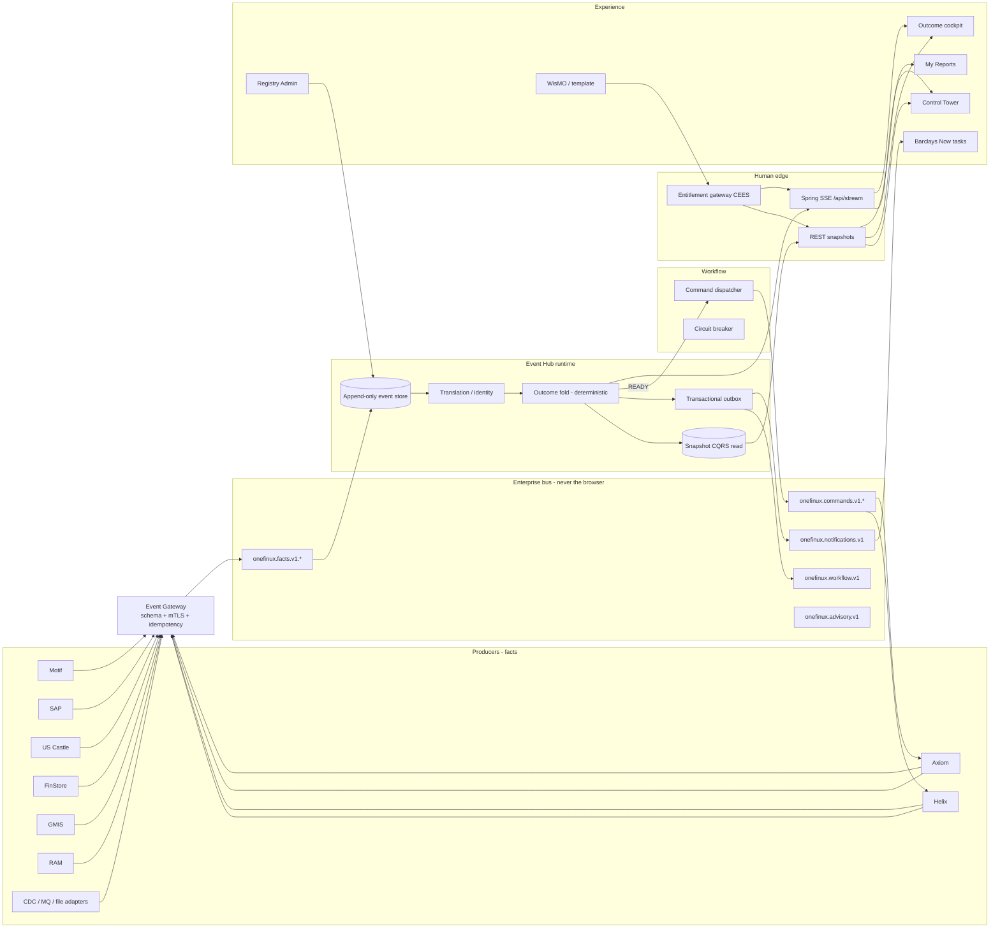

# One Finance UX — Flagship architecture, transport, and experience

**Status:** proposed  
**Date:** 2026-09-12  
**Companion to:** `2026-09-12-enterprise-event-platform-design.md`  
**Visuals:** `docs/design/dreamliner/` (Control Tower, FOBO cockpit, Reports, Admin, architecture poster)

This is the **Dreamliner** document: how a strategic pilot looks, talks, and is engineered so every later “business kind” (FOBO, 15C3, IFRS, month-end) is a configuration of the same aircraft, not a new airframe.

---

## 1. What other banks and vendors already built

We compared public products and bank event-mesh practice. None of them is this product. We steal patterns; we do not clone a close checklist.

| Product / pattern | What it is good at | Gap vs One Finance | Pattern we adopt |
|---|---|---|---|
| **BlackLine** | Continuous accounting, rec auto-certification, close task cockpit, SAP depth | Owns the rec *work*. Does not fold Motif/Helix/Axiom *facts* into “can this FOBO run?” or command Helix when 100/100 | Control-tower board; rule-based “certified” vs “blocked” |
| **Trintech Cadency** | Close + SOX evidence, maker-checker, audit packet | Same: checklist of human tasks, not a catalogue event bus | Maker-checker and evidence on every override / publish |
| **Workiva** | Connected statutory / disclosure reporting, templates | Downstream of readiness. Does not know if SAP TB or US Castle is in | Template-bound official pack; we stop at entitled viewing and hand the engine to Axiom / Workiva-class tools |
| **Nasdaq AxiomSL ControllerView + LineageView** | Reg reporting engine, data dictionary, lineage from source to submission | The **processor** we command. We must not rebuild ControllerView | Lineage tape; treat Axiom as SoR for 15C3/IFRS math |
| **Helix / internal FOBO** | Book-level matching, breaks | No bank-wide “80 of 100 books” board | Command + `runId` + break locator |
| **FloQast / HighRadius** | Mid-market close checklists, AR ops | Wrong scale and domain | Keep our UX *simpler* than a terminal; do not become a task dump |
| **Palantir Foundry (ops ontology)** | Object graph, ops apps | Heavy; political; not a governed finance event contract | Identity graph / crosswalk is our thin ontology |
| **Bank event mesh (Solace + Kafka)** | Facts at scale; Solace often fronts WebSockets to trading UIs | Kafka is not a browser protocol. Solace WS is built for market data, not entitled ops cards | Bus for systems; a **gateway** to SSE/WS for humans |
| **AWS (MSK, EventBridge, API Gateway WS, AppSync)** | Cloud landing zone | EventBridge is too coarse for COB-partitioned finance facts. Forcing AWS when the bank already has Solace/Kafka is a political failure | Optional MSK *if* the landing zone is AWS; not a requirement for the pilot |

**Positioning line for the steering committee**

> BlackLine tells you the *close task* is done. AxiomSL produces the *report*. Helix matches the *rec*. One Finance is the only place that answers *whether those machines are allowed to run*, tells them to run, and lets the entitled colleague open the result — from Motif book facts, not from a checklist.

That is the Dreamliner: one airframe, many routes.

Industry sources used: BlackLine vs Cadency close platforms; Workiva–Trintech R2R connector; Nasdaq AxiomSL ControllerView / LineageView; Solace + Kong guidance that **Kafka does not speak WebSocket/SSE** and banks put a gateway in front of browsers.

---

## 2. Detailed architecture (event hub at the centre)



**Hard rule:** browsers never subscribe to Kafka or Solace topics. Humans get a **snapshot** (REST) plus a **push** (SSE). Systems get the bus.

### 2.1 Event Hub message format (canonical)

Wire format is CloudEvents 1.0 + the generic payload (`contracts/generic-business-event.schema.json`).

**Fact (Motif → hub)**

```json
{
  "specversion": "1.0",
  "id": "motif-mb014-20260912-completed",
  "source": "motif",
  "type": "onefinux.fact.v1",
  "time": "2026-09-12T21:14:03Z",
  "datacontenttype": "application/json",
  "subject": "FOBO_HELIX/REC-EQ-EMEA",
  "data": {
    "eventType": "MASTERBOOK_READY",
    "sourceSystem": "MOTIF",
    "sourceKey": "MB014",
    "cobDate": "2026-09-12",
    "region": "GLOBAL",
    "sliceKey": "REC-EQ-EMEA",
    "status": "COMPLETED",
    "occurredAt": "2026-09-12T21:14:03Z",
    "attributes": {
      "summary": "Master book MB014 signed off"
    }
  }
}
```

**Command (hub → Helix)** — same envelope, different `type`

```json
{
  "specversion": "1.0",
  "id": "cmd-RUN-A37C3728",
  "source": "onefinux",
  "type": "onefinux.command.v1",
  "time": "2026-09-12T21:20:00Z",
  "datacontenttype": "application/json",
  "data": {
    "eventType": "WORKFLOW_ACTION_TRIGGERED",
    "sourceSystem": "ONEFINUX",
    "sourceKey": "RUN-A37C3728",
    "cobDate": "2026-09-12",
    "region": "GLOBAL",
    "sliceKey": "REC-EQ-EMEA",
    "status": "STARTED",
    "attributes": {
      "outcomeId": "FOBO_HELIX",
      "correlationId": "FOBO_HELIX/2026-09-12/GLOBAL/REC-EQ-EMEA",
      "runId": "RUN-A37C3728",
      "completionEvent": "HELIX_ANALYSIS_COMPLETE",
      "expectedKeys": ["MB001", "MB014"]
    }
  }
}
```

**Completion (Helix → hub)** must echo `runId` and a report locator.

```json
"attributes": {
  "correlationId": "FOBO_HELIX/2026-09-12/GLOBAL/REC-EQ-EMEA",
  "runId": "RUN-A37C3728",
  "summary": "12 FOBO breaks, 3 above materiality",
  "result": {
    "kind": "WISMO_GRID",
    "contentType": "application/json",
    "uri": "https://helix.internal/runs/RUN-A37C3728/breaks",
    "catalogId": "FOBO_BREAKS"
  }
}
```

SSE to the browser is **not** the bus message. It is a thin, entitled projection:

```json
{ "channel": "outcome", "key": "FOBO_HELIX/2026-09-12/GLOBAL/REC-EQ-EMEA", "status": "IN_PROGRESS", "completed": 80, "expected": 100 }
```

No unentitled keys, no raw TB rows, no producer URLs the user cannot open.

---

## 3. SSE vs WebSocket vs Kafka vs AWS

| Technology | Role | Use in this programme | Do not use for |
|---|---|---|---|
| **Enterprise bus (Solace *or* Kafka / MSK)** | Durable system-to-system facts and commands | **Required.** Prefer the bus the bank already runs. Kafka/MSK if that *is* the standard. Solace if that *is* the mesh (common in IB). | Browser clients |
| **Spring SSE (`/api/stream`)** | One-way live board | **Pilot default.** Matches the POC. HTTP-friendly through corporate proxies. Entitlement applied when the stream opens and on each event. Auto-reconnect + last-event-id. | Chat, collaborative editing, client→server commands (those stay REST) |
| **WebSocket (Spring STOMP *or* Solace WS)** | Bidirectional, many subscriptions | **Phase 3 option** if we need desktop-style multi-card fan-in at trading-floor density, or if Digital Workplace already mandates Solace WS. Not required to prove the pilot. | Replacing the bus |
| **AWS EventBridge** | SaaS/event routing | Only as an *adapter* from a cloud SaaS. Too little ordering/partition control for COB folds. | The event store |
| **AWS API Gateway WebSocket / AppSync** | Cloud-native push | Only if the UX is fully in an AWS account. Barclays colleague apps usually sit behind existing SSO/gateways. | Forcing a cloud rewrite of the hub |
| **Polling** | — | Forbidden for readiness. Adapters emit events; they do not become the UI. | — |

### Pilot decision (locked)

1. **Bus:** bank standard (document the actual name at kickoff: Solace **or** Kafka). One Finance does not invent a third bus.
2. **Store:** Oracle append-only events + snapshot tables (as already named).
3. **Human live updates:** **Spring SSE**, same path as the POC (`StreamHub`).
4. **Human writes** (override, re-run): REST, which themselves become `workflow` events.
5. **AWS:** not a prerequisite. If the landing zone is AWS, MSK may *host* Kafka. The architecture does not say “we are an AWS app.”

Why SSE wins the pilot: the board is **server → entitled user**. Overrides are infrequent and must be audited as HTTP commands anyway. WebSocket adds connection management, sticky load-balancers, and bidirectional surface area we do not need to impress a steering committee. Kafka-to-browser is an industry anti-pattern (Solace and Kong both say this explicitly).

---

## 4. Screens the programme must have

Twelve screens. That is the whole product. New “business kinds” add **cards and catalog rows**, not new apps.

| # | Screen | User | Job | Entitlement |
|---|---|---|---|---|
| 1 | **Control Tower** | Controller / HoD | See every entitled outcome as a flight instrument: question, answer, risk | `outcome.read` filter |
| 2 | **Outcome cockpit** | Controller | 80/100 keys, named failures, override, re-run, Explain | `read` + verbs for actions |
| 3 | **Lineage / event tape** | Controller / audit | Why this state; replay-safe | `read` |
| 4 | **My Reports** | Reporter / controller | Predefined entitled gallery | `report.view` |
| 5 | **Report viewer** | Same | WisMO / template / file | `view` + federated check |
| 6 | **Inbox** | All | Milestones, ready, blocked, breach | audience = CEES group |
| 7 | **Admin — Catalogue** | Platform | Event types, sources, schemas | `admin.read/publish` |
| 8 | **Admin — Outcomes** | Outcome owner | Dependencies, universe, SLA, on-ready | maker-checker |
| 9 | **Admin — Reports & entitlements** | Outcome owner | Catalog, templates, CEES, producer URL | maker-checker |
| 10 | **Maker-checker inbox** | Checker | Diff of a definition version | dual control |
| 11 | **Support — dead letters** | Platform SRE | Rejected facts, replay partition | dual control |
| 12 | **Barclays Now card** | Mobile colleague | Status + deep link | same CEES |

Wallboard mode of (1) is the **steering-committee demo**: a dark room, three instruments, live 80→100, Helix commanded, pack opens. That is the Dreamliner takeoff.

Interactive mockups live in `docs/design/dreamliner/`.

---

## 5. Experience principles (the aircraft, not the livery)

These are product rules, not decoration.

1. **One question, one word answer.** “Can I execute FOBO?” → *Not yet / Blocked / Ready / Done.* Percentages support the answer; they are not the answer.
2. **Name the missing thing.** Never “in progress.” Always “20 master books” or “BATCH-03 failed.”
3. **Instruments, not widgets.** Few cards, large type, one accent colour per state. If a screen needs a legend of twelve charts, it is wrong.
4. **Entitled emptiness.** If you cannot see 15C3, it is not greyed out — it is absent.
5. **Official reports are destinations, not decoration.** Open is a single verb, enabled only when complete and entitled.
6. **Same airframe every route.** FOBO, 15C3, IFRS, month-end share chrome, status language, and catalog buttons.
7. **Mobile is a flight pager.** Now tells you to look up; the cockpit stays desktop.
8. **Quiet confidence.** No stock photos, no confetti, no “AI powered” badges on the readiness number.

---

## 6. Engineering design principles (all engineers)

Non-negotiable. Code review rejects violations.

### 6.1 Architectural patterns

| Pattern | How we use it |
|---|---|
| **Event sourcing** | Event store is the truth. Snapshots are a cache. Replay must reproduce the board, including SLA breach and override. |
| **CQRS** | Fold writes snapshots. Control Tower reads snapshots. Never fold on GET. |
| **Transactional outbox** | Fold + “emit command / notification” in one DB transaction; bus publisher drains the outbox. No dual-write. |
| **Idempotent consumer** | `id` / `eventId` unique. Re-delivery is a no-op. |
| **Envelope + registry** | One CloudEvents envelope. New systems register; they do not add Java types. |
| **Strategy** | Universe policy (`STATIC`, `DECLARED`, `REFERENCE`, `THRESHOLD`) is a strategy interface. |
| **Specification** | Readiness is a composable spec over dependency state — not `if (fobo) …`. |
| **Process manager / saga** | `runId` is the saga id. READY → command → completion / fail / stale ignore. |
| **Hexagonal adapters** | Motif HTTP, SAP MQ, file drop are inbound adapters. Helix/Axiom are outbound. The fold does not import RestClient. |
| **Strangler** | Adapters wrap systems that cannot publish. They die when the source speaks the envelope. |
| **Circuit breaker + fail closed** | Federated entitlement and command HTTP. Open circuit: no report bytes, no silent “allowed.” |
| **Correlation** | `correlationId` + `runId` on every command and completion. |
| **Dead letter** | Gateway rejects → DLQ with RFC 7807 body. Support screen only. |
| **Feature = metadata** | A new business kind is a registry version, not a branch. |

### 6.2 Code and team principles

- **Determinism over cleverness.** No AI, no clock-dependent branch, no `HashMap` iteration forfold order. Tests are table-driven (the POC `OutcomeEngineTest` is the template).
- **Generics at the right layer.** `OutcomeInstance<Definition>` stays one class. Do not genericise HTTP controllers into a framework nobody can debug. Generic means *catalogue-driven*, not `AbstractAbstractFactory`.
- **Contract first.** Schema in `contracts/` is reviewed like code. Producers generate stubs from it.
- **Fail closed on trust.** Entitlements, report fetch, unknown `source`. Fail open only on *display* of “producer check unavailable — cannot open pack.”
- **Supportability.** Every rejected event has a reason a Motif engineer can fix. Every command has a `runId` an SRE can grep. Structured logs: `outcomeKey`, `eventId`, `runId`, `ceesDecision`.
- **Twelve-factor.** Config in the registry / env, not in images. Processes are disposable. Logs to stdout.
- **Observability SLIs.** Gateway accept rate, fold lag p99, snapshot freshness, SSE connected entitled users, command success, entitlement latency, DLQ depth.
- **Security.** SSO for humans, mTLS for producers. No secrets in events. PII not in notifications.
- **Testing.** Fold tests without Spring. Contract tests against the envelope. Entitlement tests with a fake CEES. No “UI test of Kafka.”
- **Accessibility.** Contrast, focus, keyboard override. Dreamliner is not a dark-mode poster that fails WCAG.
- **Ownership.** Runtime vs control plane vs experience. A FOBO field mapping is reference-data’s ticket, not a platform hotfix.

### 6.3 What “generic” means (and does not)

Generic **yes:** envelope, outcome definition, universe strategy, report binding enum, CEES resource template, SSE projection.

Generic **no:** a single mega-table “EntityJSON”, a rules engine that rewrites readiness in Groovy at 2am, or a UI builder that lets each desk invent a new colour system.

---

## 7. Pilot demo script (steering committee)

Ten minutes, Control Tower on a wall.

1. Tower shows FOBO *Not yet* 0/100, 15C3 *Not yet*, IFRS hidden (CEO is not entitled — make that point).
2. Books stream in; instrument moves to 80/100; names the 20 missing.
3. BATCH-03 fails on 15C3; card goes *Blocked* and a Now-style toast appears.
4. BATCH-03 completes; 15C3 *Ready*; Axiom commanded (run id on the card).
5. FOBO hits 100/100; Helix commanded; card *Done* with break count; Open shows the predefined grid.
6. Restart the hub; board rebuilds; no duplicate notifications.

If that demo needs a WebSocket or an AWS account, the architecture is overbuilt.

---

## 8. Pointers

- Envelope schema: `contracts/generic-business-event.schema.json`
- Domain design: `docs/superpowers/specs/2026-09-12-enterprise-event-platform-design.md`
- Flagship UI: `docs/design/dreamliner/index.html`
