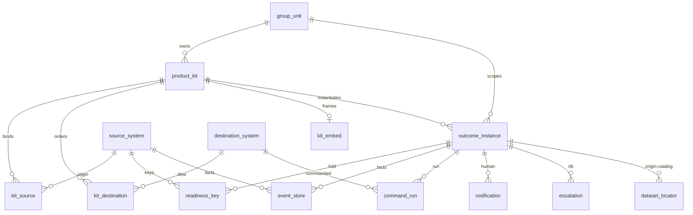

# Stitching schema and mockups (before development)

**Status:** proposed — implement Java / React only after these screens and IDs are agreed  
**DDL:** `docs/schema/onefinux-stitch.sql`  
**Job queries:** `docs/schema/onefinux-stitch-queries.sql`  
**Mockups:** `docs/design/mockups/index.html` — full application shell  
**Design system:** `docs/design/mockups/app.css` + `docs/design/mockups/components.html`

The stitch is the product. A row in `outcome_instance` is how a **group unit**, **kit**, **sources of origin**, **run**, and **partner embed** meet on one COB. Every job screen reads the same keys. There is no FOBO table and no `if (product == FOBO)`.

```
group_unit REV-ACC
    └── product_kit FOBO  (renderer HELIX_RECON, actions SIGN_OFF+POST)
            ├── kit_source → CATS, MOTIF, MBR     (origin — known now)
            ├── kit_destination → HELIX → FAS_MOTIF → PNL_AGENT
            ├── kit_embed → helix.example/fobo
            └── outcome_instance
                    FOBO|2026-09-12|APAC|R-1042   READY   run_id RUN-A37C
                    FOBO|2026-09-12|EMEA|R-2031   BLOCKED named MOTIF MB014
                            ├── readiness_key (source_id + source_key)
                            ├── event_store.instance_id + source_system
                            ├── command_run RUN-A37C → HELIX (echo_ok)
                            ├── notification / escalation / dead_letter
                            └── dataset_locator (origin recorded; analyst later)
```

POC `event_store` and `notification` stay. We **extend** them; we do not replace them.

- `event_store.source_system` already exists → join `source_system.source_id`. Do **not** add a second `source_id` column.
- Add `event_store.instance_id`, `correlation_id`, `ingest_offset`.
- Add `notification.instance_id`, `group_unit_id`.
- Kits replace YAML-in-`application.yml` as the source of truth once Task 1 lands.

**Do not start fold / UI code until** the mockups in `docs/design/mockups/` are accepted.

---

## Canonical stitch keys (printed on every mockup)

| Key | Example | Meaning |
|---|---|---|
| `group_unit_id` | `REV-ACC` | Tenant / CEES `groupUnit:REV-ACC` |
| `kit_id` | `FOBO` | Product is data. Renderer + actions live here |
| `instance_id` | `FOBO\|2026-09-12\|APAC\|R-1042` | kit \| cob \| region \| slice |
| `slice_key` | `R-1042` | Rec / report / book the user named |
| `source_id` | `CATS` `MOTIF` `MBR` | Origin — bound on the kit now |
| `source_key` | `MB014` | Distinct key the fold counts |
| `run_id` | `RUN-A37C` | Downstream command; completions must echo it |
| `embed_url` | `https://helix.example/fobo` | Partner iframe, host chrome |

---

## How rows join



---

## Tables

| Table | Role | First slice |
|---|---|---|
| `group_unit` | Tenant | Yes |
| `source_system` | Known origin catalog | Yes |
| `destination_system` | Command / notify targets | Yes |
| `product_kit` | Outcome definition (data) | Yes |
| `kit_source` / `kit_destination` / `kit_embed` | Bindings | Yes |
| `outcome_instance` | The stitch for a COB | Yes |
| `readiness_key` | Distinct keys the fold counts | Yes |
| `event_store` | Append-only facts (extend POC) | Yes |
| `command_run` | Downstream; `echo_ok` only if `run_id` echoed | Yes |
| `notification` | Human SSE / Barclays Now (extend POC) | Yes |
| `escalation` / `feed_watermark` / `dead_letter` | RTB | Yes |
| `dataset_locator` | Record origin now | Yes — no explorer UI |
| `analyst_view_def` | Wijmo defs | **Created empty. Do not wire.** |

CEES is fail-closed and external. We store resource ids (`groupUnit:REV-ACC`, `product:FOBO`), not a local ACL table.

---

## Fold rules (unchanged)

- Events are facts. The fold counts **distinct** `(instance_id, source_id, source_key)`.
- `FAILED` on a required key **blocks**.
- `REVOKED` **withdraws** a prior completion.
- Downstream completions must echo `run_id` → `command_run.echo_ok = Y`.
- One event can feed many instances (same source_key, different kits) — stitch via `instance_id` on the copy that belongs to this outcome, not by inventing a product column.
- LLM / Agent Analysis is advisory and **never** on the readiness fold.

---

## What each job reads

| Job | View / join | Must not see |
|---|---|---|
| BU head | `v_head_board` where `group_unit_id` entitled | Post, iframe, dead-letter payload |
| Outcome user | `v_user_card` + `v_readiness_fold` | Config, watermarks |
| Ready / iframe | `kit_embed` + query `groupUnitId`, `productId`, `outcomeId`, `cobDate`, `region`, `runId`, `theme=ofx` | Analyst studio |
| RTB | `escalation` ⨝ `outcome_instance` ⨝ `dead_letter` + `feed_watermark` | Sign-off |
| Config | `group_unit` + `source_system` + kit + embed | Day-one FlexGrid authoring |

---

## Seed (matches mockups)

Two instances on COB 12 Sep 2026, unit `REV-ACC`, kit `FOBO`:

| instance_id | Status | Why |
|---|---|---|
| `FOBO\|2026-09-12\|APAC\|R-1042` | READY | CATS + MOTIF + MBR COMPLETED; `RUN-A37C` echo_ok=Y |
| `FOBO\|2026-09-12\|EMEA\|R-2031` | BLOCKED | MOTIF `MB014` FAILED; escalation `ESC-19`; dead letter `DL-4402` |

---

## Oracle 19c later

H2 types in this file. On Oracle: `VARCHAR` → `VARCHAR2`, identity → `NUMBER GENERATED BY DEFAULT AS IDENTITY`, `CREATE OR REPLACE VIEW` stays. `MERGE` / `ADD COLUMN IF NOT EXISTS` become the migration tool of record (Flyway) in Task 1 — not now.
